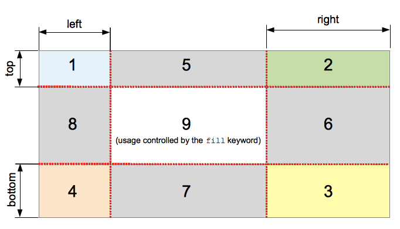
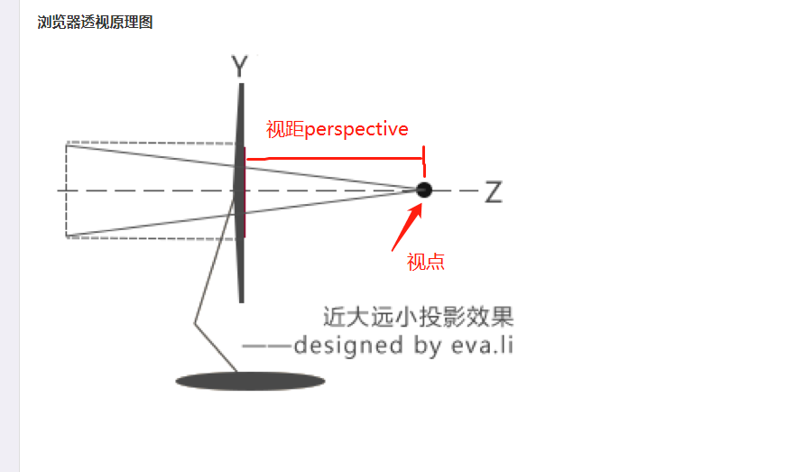
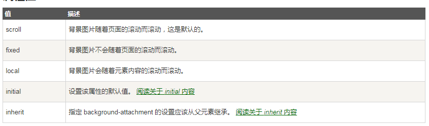

### CSS3 中新单位 vh,vw,vmin,vmax

#### 单位的含义

~~~css
vh,vw,vmin,vmax 是一种视窗单位，也是相对单位。
但是相对的不是父节点或者根节点，而是由视窗(viewport)大小来决定的。单位为1,类似于1%；

vh:视窗高度的百分比
vw:视窗宽度的百分比
vmin:当前vw,vh中较小的值
vmax:当前vw,vh中较大的值
~~~

#### 和百分比的区别

~~~css
%是由父级节点大小设定的，vh,vw是由视窗大小决定的
vh,vw能够直接获取高度
~~~

### 字符串在html中页面中换行

~~~css
在需要渲染字符串的标签 样式中加入 white-space:pre-line;属性和属性值，就能支持\n换行了

word-wrap和word-break 也是文字换行，主要是针对英文字符
~~~

### 谷歌浏览器滚动条的样式设置

~~~css
::-webkit-scrollbar 滚动条整体部分(开启自定义滚动条)
::-webkit-scrollbar-thumb 滚动条里面的小方块，能向上向下动
::-webkit-scrollbar-track 滚动条的轨道
::-webkit-scrollbar-button 滚动条的轨道的两端按钮，由于通过点击微调小方块的位置。
::-webkit-scrollbar-track-piece 内层轨道，滚动条中间部分
::-webkit-scrollbar-corner 边角，即垂直滚动条和水平滚动条相交的地方
::-webkit-resizer 两个滚动条的交汇处上用于拖动调整元素大小的小控件

::-webkit-scrollbar{
    width:8px;
}
::-webkit-scrollbar-thumb{
    -webkit-box-shadow:inset 0 0 2px rgba(0,0,0,0.5);
    background-color:#cccccc;
}
::-webkit-scrollbar-track{
    background-color:
}
//经过小按钮时的样式
::-webkit-scrollbar-thumb:hover{}
//小按钮点击时的样式
::-webkit-scrollbar-thumb:active{} 
//浏览器当前的窗口失焦时显示的样式
::-webkit-scrollbar-thumb:window-inactive{
    
}

~~~

### border-image

> border-image-source：
>
> ~~~javascript
> url() 图片的地址
> ~~~
>
> border-image-slice: 数值 （上 右 下 左）
>
> ~~~javascript
> 将url中指向的图片 切成9块
> 1,2,3,4按照数值放在四角
> 5,6,7,8按照(repeat的类型进行拉伸或者重复等操作) 
> 1的大小为： 数值
> 2的大小为：数值
> 3的大小为：数值
> 4的大小为：数值
> ~~~
>
> > 
>
> border-image-repeat: 
>
> ~~~javascript
> 取值为：round stretch repeat;
> /*2.4 平铺的方式  三种平铺方式 round stretch repeat*/
> /*round 环绕 完整的自适应（等比缩放）平铺在边框内*/
> /*stretch 拉伸 拉伸显示在边框内容 变形的*/
> /*repeat 平铺 从边框的中间向两侧平铺 自适应平铺但是不是完整的*/
> ~~~
>
> border-image-width: 边框的宽度 数值类型的

### transform:translate(x,y)会提升层级 z-index会提升

### 2D转换 transform 

> transform: 移动、缩放、旋转、拉伸或拉长
>
> transform-origin ：原点的位置设置（top right bottom left center %）
>
> ~~~javascript
> translate() translateX() translateY()
> scale() scaleX() scaleY()
> rotate() 
> skew() skewX() skewY()
> 
> ~~~

### 3D转换 transform 

> transform 
>
> transform-origin
>
> transform-style:perserve-3d | flat
>
> ~~~java
> //transform-style:perserve-3d； 所有的子元素都在3d环境下展示
> //transform-style:flat; 所有子元素都在2d环境下展示
> ~~~
>
> 
>
> perspective ：数值|3D元素的透视效果 
>
> > 视距距离视点越小时，屏幕展示效果越大，当视距超出视点时就不会在屏幕中显示了
> >
> > 相反的，视距距离视点越小，屏幕展示效果就越小
>
> perspective-origin：3D元素的底部位置
>
> >  个人理解为视点的**xy坐标**，**perspective**则是**z坐标**，三者可以再三维中确定 视点的唯一位置 
>
> 
>
> backface-visibility：元素不面对屏幕时是否显示

### transition 过渡效果

> transition:
>
> ~~~css
> transition:简写的模式 有四个值
> ~~~
>
> transition-property:定义需要动画的css属性名
>
> ~~~css
> /*取值*/
> all 常用
> width
> height
> opacity ...
> ~~~
>
> 
>
> transition-duration：动画的执行时间
>
> transition-timing-function：动画的执行效果
>
> ~~~css
> /*取值*/
> linear
> ease
> ease-in
> ease-out
> ease-in-out
> 
> ~~~
>
> 
>
> transition-delay: 动画是否延时执行

### background-size

> ~~~css
> cover：在最大尺寸上满足容器，在容器中平铺，高度上面显示不了时就隐藏掉
> contain:在容器大小内，放入图片：如果容器的最小尺寸小于图片的话，那么图片会有缩小，适应容器的最小尺寸
> ~~~

### background-attachment

>  置背景图像是否固定或者随着页面的其余部分滚动 
>
> ~~~css 
> background-attachment:fixed;在页面中的位置固定不变，只是容器随着滚动条在页面结构中滚动
> ~~~
>
> 

### html5shiv

~~~css
html5shiv.min.js文件的作用：
让浏览器认识HTML5标签，并且使css样式起作用
使用方法
<!--[if lte IE 9]>
	
<![endif]-->
~~~

### classList

> 和jQuery中的addClass removeClass hasClass toggleClass  的方法相似
>
> ~~~javascript
> el=document.querySelector('div')
> el.classList.add()
> el.classList.remove()
> el.classList.toggle()
> el.classList.contains()
> //特别注意不能像jquery那样 链式写 add().remove()
> ~~~

### 自定义的属性 data-XXX

> 在jquery中的获取方法
>
> ~~~javascript
> result=$('div').data() 获取到
> result的结果为对象 {} 或者 undefined
> 
> //获取其中某一个的值
> $('div').data('user')
> //设置或者修改某一值
> $('div').data('user','aaa')
> 
> 
> ~~~
>
> 在原生方法中
>
> ~~~JavaScript
> result=document.querySelector('div')
> //获取所有的自定义的data-xxx的值
> result.dataset 返回的是对象
> result.dataset.user="hhh" //添加或者修改现有的值
> //特别注意的是如果data-xxx的命名方式是 data-xxx-yyy的格式，那么不论是jquery还是原生的获取的自定义的属性名都按照 驼峰的命名方法
> ~~~
>

### document.documentElement.clientWidth和window.innerWidth的区别

~~~ css
document.documentElement.clientWidth 的值是不包括滚动条的宽度值的
window.innerWidth的宽度是包含宽度值的
document.documentElement  的返回值是 <html></html>的根标签
~~~

###  canvas 不是快级元素

+ 调整canvas的大小和窗口一样大时，会有滚动条出现：解决方法为canvas{display:block}
+ canvas的drawImage 中灰度值的采集方法为 imageData 中的 （data[0]+data[1]+data[2]）/3 取平均值 重新的赋值 cxt.putImageData(imgD,0,0)

#### Failed to execute 'getImageData' on 'CanvasRenderingContext2D': The canvas has been tainted by cross-origin data.

~~~css
解决的方法是在服务器环境下操作
~~~

#### arc起始点的问题

~~~css
arc 起始点在3点钟的方向，要改成12点的反向需要在结束角度 -Math.PI/2 个圆弧度 开始角度为 1.5*Math.PI
~~~

#### canvas有一个捕捉流的API

~~~css
HTMLCanvasElement.captureStream()
HTMLVideoElement.captureStream()
~~~

#### canvas 的clip裁切路径问题

~~~css
先要绘制裁切的路径形状
然后在绘制其他图形
~~~

#### createLinearGradient(x1,y1,x2,y2)

~~~css
x1,y1是渐变效果的初始位置
x2,y2是渐变效果的结束位置

有返回值 为：当前创建的渐变 对象
有一个方法为 addColorStop(position,color)
position为0~1之间的值，包含0和1 表示渐变中颜色所在的相对位置
配合颜色的添加 tempLinear=cxt.createLinearGradient(...)
			tempLinear.addColorStop(0,'orange')
			tempLinear.addColorStop(1,'blue')
这里只是一个 线性渐变的添加条件
还需要一个渲染的容器
cxt.fillRect(0,0,100,100) 在这个容器中渲染出 渐变效果
~~~

### line-clamp

~~~css
//多行文本的省略号
text-overflow:ellipsis;
overflow:hidden;
display: -webkit-box;
-webkit-box-orient: vertical;
-webkit-line-clamp: 3;//限制在一个块元素显示的文本的行数
~~~

### enctype 对提交的数据进行编码方式

`enctype=text/plain;` `enctype=multipart/form-data` `enctype=application/x-www-form-urlencoded`

~~~css
enctype的意思是表单数据在发送给服务器之前的如何对其进行编码
text/plain: 将字符串中的 `空格` 转换成 `+`
multipart/form-data: 不对字符进行编码，但是有文件上传的控件时，enctype的该值是唯一的
application/x-www-form-urlencoded:对字符进行编码，将字符串中的`+`转成`空格`，将特殊字符转成ASCII的16进制的
~~~

### 页面变灰的方式

~~~css
body{
    filter:grayscale(100%);
    -webkit-filter:grayscale(100%);
    -moz-filter:grayscale(100%);
    -ms-filter:grayscale(100%);
   	-o-filter:grayscale(100%);
}
~~~

### line-height

~~~css
line-height:1.15; 不带单位的意思是：行高是字体高度的1.15倍
~~~

### rem 和em

~~~css 
em:是参照父级元素中的文字大小(px)来设置尺寸，所以即使元素设置相同的em尺寸大小，如果元素中的文字大小不一样，那么他们的大小也不一样：
div1.width:20em;height:5em;font-size:16px;
div2:width:20em;height:5em;font-size:25px;

rem:是根据html根标签的文字大小为尺寸依据的；
~~~

### progress 样式的自定义

~~~css

.mypro{
    background:orange;
    color:deeppink;
    border:1px solid red;
    border:2px solid #000;
    width:300px;height:50px;
}
.mypro::-ms-fill{background:deeppink;}
.mypro::-moz-progress-bar{background:deeppink;}
.mypro::-webkit-progress-bar{background:orange;}
.mypro::-webkit-progress-value{background:deeppink;}

~~~

### input[type=range]的样式设置

~~~css
//滑块样式
input[type=range]::-webkit-slider-thumb{
    -webkit-appearance:none;
    
}
input[type=range]::-moz-slider-thumb{
    
}

//滑条样式  谷歌下的写法
input[type=range]{
    -webkit-apperance:none;//去掉默认的样式
}
//火狐的写法
input[type=range]::-moz-range-track{
    
}
~~~

### 知识点

~~~css
itemprop是用于向html标签中添加属性， 每个html标签都可以添加，itemprop属性， name-value组成
value的值可以是string或者url

  <h1 itemprop="name">Avatar</h1>
  Director:
    James Cameron
    (born August 16, 1954)
  Science fiction
  <a href="../movies/avatar-theatrical-trailer.html"
    itemprop="trailer">Trailer</a>

~~~

### css3中的渐变

~~~css
属性名：background-image 用来承载渐变效果
渐变类型有两种： 
	线性：linear-gradient()
	径向:radial-gradient()
~~~

#### css3 filter 滤镜

~~~css
filter:drop-shadow(2px 2px 2px black);
filter:drop-shadow(2px 2px 2px rgba(0, 0, 0, 0.33));
drop-shadow和box-shadow相似
但是drop-shadow没有内阴影，drop-shadow不能阴影叠加
~~~

### Less

~~~css
注释
// 是不会编译输出到.css文件中的
/**/中的注释会输出到.css文件中
选择器也是变量类型时的方法
.h@{属性名}{} //属性名前面不需要加上@了
~~~

#### 变量 @

~~~css
@属性名:值；
~~~

#### 混合

~~~css
1.普通混合=》混合选择器对象会输出到 .css文件中
2.不带输出的混合
3.带选择器的混合=》要混合的选择器对象中有 & 链接符
.mixins(){ &:hover{color:red;}}
4.带参数的混合
.mixins(@color){}
5.带参数并且有默认值
6.带多个参数的的混合=》在表达式中 使用分号分隔；在调用时使用逗号分隔实参
.mixins(@color;@width){}
.border{.mixins(red,200px);}
7.命名参数=》在调用的时候使用使用对应的变量名和值一一对应,解决传参时需要循序的问题
.mixins(@color;@width){}
.border{.mixins(@width:200px,@color:red)}
8.@arguments变量=》包含了所有传递进来的参数。
    .shadow(@x;@y;@z;@color){
        box-shadow:@arguments;
    }
    .box{
        .shadow(1px,1px,2px,rgba(0,0,0,0.3))
    }
9.匹配模式=> 混合中的 & 代表的就是父级选择器 有空格的时候代表父子层级嵌套， 没有空格 就和 父级.[&]符号后面的选择器名
.mixins(dark,@color){color:darken(@color,10%);}
.mixins(light,@color){color:lighten(@color,10%);}
.box{
    .mixins(light,#ff0000);
}
10.得到混合中变量的返回值
    
~~~

##### 引导混合

~~~css
使用表达式进行匹配，不是根据值和参数匹配时，引导就显得非常有用
when关键字用以定义一个导引序列
.mixins(@a) when(lighteness(@a)>=50%){
    background-color:black;
}
.mixins(@a) when(lighteness(@a)<50%){
    background-color:white;
}
.class1{.mixins(#ddd);}
.class2{.mixins(#555);}

when:
1.可以使用全部比较运算符 >< >= <= =
	when(@a=true)
2.when中使用逗号[,] 表示 当且仅当所有条件都符合，才能匹配成功
        .mixins(@a) when(@a>10),(@a<-10){}
3.and关键字
when(isnumber(@a)) and (@a>0){}
4.not关键字
when not(@b>0){}
~~~

#### 嵌套规则

~~~css
父元素选择器 &
~~~

#### 运算

~~~css
1.数值型运算 =》其中一个必须有单位 加减乘除
2.颜色值运算 =》颜色值必须是16进制的色值
~~~

#### 函数

~~~css
检测函数
iscolor()
isnumber()
isstring()
iskeyword()
isurl()
判断单位
ispixel()
ispercentage()
isem()
颜色函数
rgba()
rgb()
blue()
saturate(@color,10%) 饱和度
desaturate(@color,10%)减小饱和度
fadein(@color,10%)
fadeout(@color,10%)
fade(@color,10%)    fade的作用和rgba的作用相似
spin(@color,10)
spin(@color,-10)
mix(@color1,@color2)
提取颜色信息
    lighteness()
    hue()
    saturation()
    
Math函数
    round(1.67)//return 2
    ceil(2.2)// return 3
    floor(2.6) //return 2
    percentage(0.5) //50%;

函数库的分类
1.其他函数
2.字符串函数
3.长度相关函数 
4.数学函数
5.类型函数
6.颜色值定义函数
7.颜色值通道函数
8.颜色值运算函数
9.颜色混合函数
~~~

#### 命名空间

~~~css
将一些变量或者混合模块打包起来 形成的选择器对象 ，可以通过嵌套的规则来实现

可以在混合的模块中通过 css的父子选择器的方式 选择需要的新混合样式添加到 当前选择器中 如：div{.mixins .a;}
~~~

#### 作用域

~~~css
less中的作用域和编程语言中的作用域概念相似，首先会在局部内 查找变量和混合，如果没有就会到 它的 父级作用域中查找
~~~

#### 引入import

~~~css
可以引入一个或多个less文件，然后在引入的文件中可以使用素有less文件中的变量和混合包

1.引用.css文件是css文件中的样式会原样的输出到编译后的文件中，并且.css中的选择器不能当做 混合包来引用
	在.less文件中引入 @import 'base.css';
	在.less文件编译后的结果中 css文件还是 原样的输出 即 @import 'base.css';

2.@import 文件时的可带参数
    once		默认的 只包含一次
    reference	使用less文件但是不输出:可以使用其中的变量和混合包，但是在编译时不会输出
    inline		在输出中包含源文件但是不加工它
    less		将引入的源文件当作less文件，无论引入的扩展名是什么
    css			将引入的源文件当作css文件，无论引入的扩展名是什么
    multiple	允许引入多次相同文件名的文件
    

~~~

#### 关键字 important

~~~css
在调用混合选择器时，在后面加上!important;关键字后 混合包中所有的属性都会加上!important;关键字的
.mixins(){
    width:200px;
}
div{
    .mixins()!important;
}
~~~

#### 条件表达式

~~~css
就是上面写的带条件的混合引导
~~~

#### 循环 loop

~~~css
混合可以调用自身的特性，当一个混合递归调用自身，在结合 when 表达式和匹配模式，就可以写出循环结构
.loop(@count) when(@count<7){
    .h@{count}{
        width:(@count*10px);
    }
    .loop(@count+1);
}

div{
    .loop(1);
}
~~~

#### 合并属性

~~~css
合并属性：在less中分散写的样式，在编译后需要合并相同属性名的值，但是它们的值有不同合并要求时的处理方法 =》 background+:或者background+_:两种方式
+ 加号=>表示合并后的属性值是以 ，逗号分隔
+_ 这种=>表示合并后的属性值是以 空格号 分隔

1.+_
.mixins(){
    background+_:no-repeat;
    background+_:url('');
    background+_:center center;
}
div{
    background+_:orange;
    .mixins();
}
编译结果为：
div{background:orange no-repeat url('') center center;}

2.+
.mixins1(){
    box-shadow+:inset 2px 2px 2px rgba(0,0,0,0.5);
}
.box{
    .mixins1();
    box-shadow+:2px 2px 2px rgba(25,25,25,0.4);
}
编译结果
.box{2px 2px 2px rgba(0,0,0,0.5) inset,2px 2px 2px rgba(25,25,25,0.4);}
~~~

#### 
