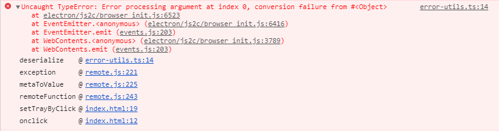
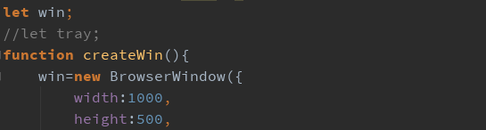
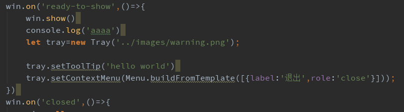
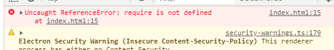
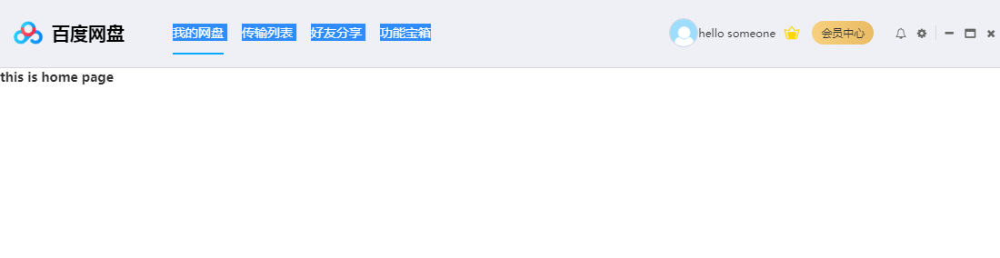
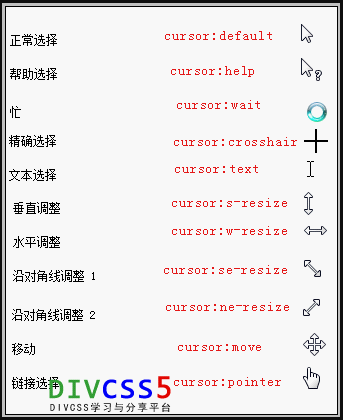
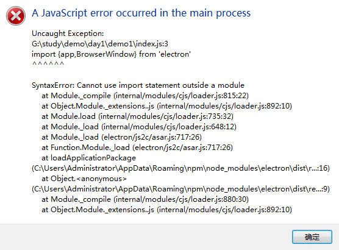

### child-process

>核心模块的名称为： child_process 不是child-process
>
>~~~javascript
>//常用的方法
>exec('shell 命令',(err,stdout,stderr)=>{})
>//还有三种方法，需要查资料
>~~~
>

### nativeImage 是NativeImage的实例

> + 使用的方法
>   + const {nativeImage}=require('electron')
>   + 
>   + 使用

### Tray的使用注意事项

> + 在入口文件中可以使用全局变量的方法 let tray=null;
>   +  **解决tray显示一会就消失的问题**这个问题，似乎很诡异。其实就是你的写法问题，非全局变量会被定期回收。你的`tray`肯定是个函数内部的局部变量，而不是最顶层的全局变量。这就会导致，你的托盘被系统当成垃圾回收啦。就这么回事，所以把你的变量定义，提升到顶层即可。 
>   + 
> + 或者在优雅加载页面的方式下面加载tray
>   + 
> + 不知道拿错了 **现在解决了: 就是tray中要使用绝对路径**
>   +  原因在 tray的图标应该设置成绝对路径，不要用相对路径。 
>   + 

### require is not defined

> + 
>   + 错误原因是浏览器不是node的集成环境，不认识require关键字

### path.join 和path.resolve的区别

~~~javascript
path.join(__dirname,'路径名次')//路径名称是相对路径的 返回的就是相对路径，如果是绝对路径的那就返回绝对路径
path.resolve(__dirname,'路径名称')//不管路径名次是什么返回的都是绝对路径
~~~

### user-select:none;

> 禁止用户按下鼠标左键是选中文字的样式
>
> 

### cursor: 

> 改变鼠标指针的样式
>
> 
>
> **使用自定义的鼠标样式**
>
> cursor:url('./light.png'), default; 一定要有default  图片的格式png\gif \jpg

### frame | transparent 在windows中不要一起用

> 原因是： win.isMaximize()  方法返回的结果都是false

### electron 使用import 模块化时报错的原因

+ [ 查看链接 ][http://www.itkeyword.com/doc/6155234927226421x791/es6-syntax-import-electron-require]
+ 需要使用第三方的模块

### This is probably not a problem with npm. 

~~~javascript	
//解决方法
rm -rf node_modules
rm -rf package-lock.json
npm cache clear --force
npm install
~~~

### nsis 配置

~~~javascript
"build": {

    "productName":"xxxx",//项目名 这也是生成的exe文件的前缀名

    "appId": "com.leon.xxxxx",//包名  

    "copyright":"xxxx",//版权  信息

    "directories": { // 输出文件夹

      		"output": "build"

    	}, 

    "nsis": {

      "oneClick": false, // 是否一键安装

      "allowElevation": true, // 允许请求提升。 如果为false，则用户必须使用提升的权限重新启动安装程序。

      "allowToChangeInstallationDirectory": true, // 允许修改安装目录

      "installerIcon": "./build/icons/aaa.ico",// 安装图标

      "uninstallerIcon": "./build/icons/bbb.ico",//卸载图标

      "installerHeaderIcon": "./build/icons/aaa.ico", // 安装时头部图标

      "createDesktopShortcut": true, // 创建桌面图标

      "createStartMenuShortcut": true,// 创建开始菜单图标

      "shortcutName": "xxxx", // 图标名称

      "include": "build/script/installer.nsh", // 包含的自定义nsis脚本

    },

    "files": [

		      "dist/electron/**/*"
	
	    ],
    "win": {

     	 "icon": "build/icons/aims.ico",

	      "target": [
	
		        {
		
			          "target": "nsis",
			
			          "arch": [
			
			            "ia32",//32位的 
                          "x64"//64位的
			
			          ]
		
		        }
		
	      ]

    },

  }
~~~

### sqlite3 和electron-vue的结合使用方法

~~~javascript	
1.npm install gyp -S
2.npm install node-pre-gyp -S
3.npm install sqlite3 -S
4.//在package.json中添加 
	"postinstall":"install-app-deps"
5.npm run postinstall

~~~

### tray托盘的使用时一定要定义全局变量 

~~~ 
let tray=null;
tray=new Tray()

~~~

### 视频音频的MIME类型的书写方法

~~~css
从根本上讲，您可以使用简单的MIME类型（例如video/mp4或）来指定媒体文件的类型audio/mpeg。但是，许多媒体类型（尤其是支持视频轨道的媒体类型）都可以从更精确地描述其中的数据格式的能力中受益。例如，仅以MIME类型在MPEG-4文件中描述视频，video/mp4并没有说明实际媒体所采用的格式。但是，每种MIME类型都是模糊的。所有这些文件类型都支持多种编解码器，并且这些编解码器可以具有任意数量的配置文件，级别和其他配置因素。因此，您可以将codecs参数添加到媒体类型。

因此，codecs可以将参数添加到描述媒体内容的MIME类型中。有了它，可以提供特定于容器的信息。此信息可能包括诸如视频编解码器的配置文件，用于音轨的类型等内容。
use-methods:
请在前面;加上分号（）codecs=，然后再加上描述文件内容格式的字符串。某些媒体类型仅允许您指定要使用的编解码器的名称，而其他媒体类型还允许您对这些编解码器指定各种约束。您可以使用逗号分隔多个编解码器。

audio/ogg; codecs=vorbis
包含Vorbis音轨的Ogg文件。

video/webm; codecs="vp8, vorbis"
video/webm;codecs="h264"//使用的方法为{mimeType:"video/webm;codecs:h264"}
甲WebM的含有文件VP8视频和/或Vorbis的音频。

video/mp4; codecs="avc1.4d002a"
一个MPEG-4文件包含AVC（H.264）的视频，主轮廓，级别4.2。

与任何MIME类型参数一样，如果编解码器的任何属性使用特殊字符，则必须将codecs其更改为codecs*（请注意星号字符*），这些特殊字符必须按照RFC 2231第4节“ MIME参数值和编码”进行百分比编码词扩展。您可以使用JavaScript encodeURI()函数对参数列表进行编码。同样，您可以decodeURI()用来解码以前编码的参数列表。
~~~

### 第三方库的使用方法问题

+ robotjs 控制鼠标和键盘  使用时是需要编译的

  ~~~css
  1.window 环境下
  	npm install --global --production windows-build-tools 最好是以管理员运行cmd
  	npm install -g node-gyp
  	node-gyp rebuild
	npm install robotjs -S
  	npm install electron-rebuild -D //当前的项目下
  	npx electron-rebuild 自动编译
  ~~~

