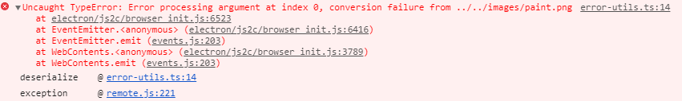

### nativeImage 是NativeImage的实例

> + 使用的方法
>   + const {nativeImage}=require('electron')
>   + 
>   + 使用

### Tray的使用注意事项

> + 在入口文件中可以使用全局变量的方法 let tray=null;
>   +  **解决tray显示一会就消失的问题**这个问题，似乎很诡异。其实就是你的写法问题，非全局变量会被定期回收。你的`tray`肯定是个函数内部的局部变量，而不是最顶层的全局变量。这就会导致，你的托盘被系统当成垃圾回收啦。就这么回事，所以把你的变量定义，提升到顶层即可。 
>   + 
> + 或者在优雅加载页面的方式下面加载tray
>   + 
> + 不知道拿错了 **现在解决了: 就是tray中要使用绝对路径**
>   +  原因在 tray的图标应该设置成绝对路径，不要用相对路径。 
>   + 

### require is not defined

> + 
>   + 错误原因是浏览器不是node的集成环境，不认识require关键字

### path.join 和path.resolve的区别

~~~javascript
path.join(__dirname,'路径名次')//路径名称是相对路径的 返回的就是相对路径，如果是绝对路径的那就返回绝对路径
path.resolve(__dirname,'路径名称')//不管路径名次是什么返回的都是绝对路径
~~~

### user-select:none;input\textarea中的还是可以选中的

> 禁止用户按下鼠标左键是选中文字的样式
>
> 

### cursor: 

> 改变鼠标指针的样式
>
> 
>
> **使用自定义的鼠标样式**
>
> cursor:url('./light.png'), default; 一定要有default  图片的格式png\gif \jpg

### frame | transparent 在windows中不要一起用

> 原因是： win.isMaximize()  方法返回的结果都是false

### electron 使用import 模块化时报错的原因

+ [ 查看链接 ][http://www.itkeyword.com/doc/6155234927226421x791/es6-syntax-import-electron-require]
+ 需要使用第三方的模块

### This is probably not a problem with npm. 

~~~javascript	
//解决方法
rm -rf node_modules
rm -rf package-lock.json
npm cache clear --force
npm install
~~~

### nsis 配置

~~~javascript
"build": {

    "productName":"xxxx",//项目名 这也是生成的exe文件的前缀名

    "appId": "com.leon.xxxxx",//包名  

    "copyright":"xxxx",//版权  信息

    "directories": { // 输出文件夹

      		"output": "build"

    	}, 

    "nsis": {

      "oneClick": false, // 是否一键安装

      "allowElevation": true, // 允许请求提升。 如果为false，则用户必须使用提升的权限重新启动安装程序。

      "allowToChangeInstallationDirectory": true, // 允许修改安装目录

      "installerIcon": "./build/icons/aaa.ico",// 安装图标

      "uninstallerIcon": "./build/icons/bbb.ico",//卸载图标

      "installerHeaderIcon": "./build/icons/aaa.ico", // 安装时头部图标

      "createDesktopShortcut": true, // 创建桌面图标

      "createStartMenuShortcut": true,// 创建开始菜单图标

      "shortcutName": "xxxx", // 图标名称

      "include": "build/script/installer.nsh", // 包含的自定义nsis脚本

    },

    "files": [

		      "dist/electron/**/*"
	
	    ],
    "win": {

     	 "icon": "build/icons/aims.ico",

	      "target": [
	
		        {
		
			          "target": "nsis",
			
			          "arch": [
			
			            "ia32",//32位的 
                          "x64"//64位的
			
			          ]
		
		        }
		
	      ]

    },

  }
~~~

### sqlite3 和electron-vue的结合使用方法

~~~javascript	
1.npm install gyp -S
2.npm install node-pre-gyp -S
3.npm install sqlite3 -S
4.//在package.json中添加 
	"postinstall":"install-app-deps"
5.npm run postinstall

还有一个插件 better-sqlite3说是比sqlite3好用

~~~

### tray托盘的使用时一定要定义全局变量 

~~~ 
let tray=null;
tray=new Tray()

~~~

### 视频音频的MIME类型的书写方法

~~~css
从根本上讲，您可以使用简单的MIME类型（例如video/mp4或）来指定媒体文件的类型audio/mpeg。但是，许多媒体类型（尤其是支持视频轨道的媒体类型）都可以从更精确地描述其中的数据格式的能力中受益。例如，仅以MIME类型在MPEG-4文件中描述视频，video/mp4并没有说明实际媒体所采用的格式。但是，每种MIME类型都是模糊的。所有这些文件类型都支持多种编解码器，并且这些编解码器可以具有任意数量的配置文件，级别和其他配置因素。因此，您可以将codecs参数添加到媒体类型。

因此，codecs可以将参数添加到描述媒体内容的MIME类型中。有了它，可以提供特定于容器的信息。此信息可能包括诸如视频编解码器的配置文件，用于音轨的类型等内容。
use-methods:
请在前面;加上分号（）codecs=，然后再加上描述文件内容格式的字符串。某些媒体类型仅允许您指定要使用的编解码器的名称，而其他媒体类型还允许您对这些编解码器指定各种约束。您可以使用逗号分隔多个编解码器。

audio/ogg; codecs=vorbis
包含Vorbis音轨的Ogg文件。

video/webm; codecs="vp8, vorbis"
video/webm;codecs="h264"//使用的方法为{mimeType:"video/webm;codecs=‘h264’"}
甲WebM的含有文件VP8视频和/或Vorbis的音频。

video/mp4; codecs="avc1.4d002a"
一个MPEG-4文件包含AVC（H.264）的视频，主轮廓，级别4.2。

与任何MIME类型参数一样，如果编解码器的任何属性使用特殊字符，则必须将codecs其更改为codecs*（请注意星号字符*），这些特殊字符必须按照RFC 2231第4节“ MIME参数值和编码”进行百分比编码词扩展。您可以使用JavaScript encodeURI()函数对参数列表进行编码。同样，您可以decodeURI()用来解码以前编码的参数列表。
~~~

### 第三方库的使用方法问题

+ robotjs 控制鼠标和键盘  使用时是需要编译的

  ~~~css
  1.window 环境下
  	npm install --global --production windows-build-tools 最好是以管理员运行cmd
  	npm install -g node-gyp
  	node-gyp rebuild
	npm install robotjs -S
  	npm install electron-rebuild -D //当前的项目下
  	npx electron-rebuild 自动编译
  ~~~
  
+ 上面是一种方法还有一种方法

  ~~~css
  卸载掉所有的 npm uninstall -g windows-build-tools
  npm uninstall -g node-gyp 
  在c://user/appdata/roming/ 删除 npm 
  删除 目录下的.electron.gyp
  删除 .node-gyp
  删除 .window-build-tools 
  清理软件清一下垃圾
  重新启动电脑
  
  清理一下环境变量
  下载并安装python2.7的环境,环境变量中添加工作路基
  下载vs2017的安装工具
  安装2017的社区版 选则 工作负载为 c++的桌面开发
  
  npm config set --global python 环境变量的路径
  npm config set --global msvs_version 2017
  
  下面就可以下载c++等库了
  
  ~~~

  

### FFmpeg的使用方法

~~~css
"ffplay播放没有声音SDL_OpenAudio (2 channels, 44100 Hz): WASAPI can't initialize audio client" 出现这种错误的解决方法

1.打开系统环境变量
2.点击新建环境变量
3.‘变量名’：=》SDL_AUDIODRIVER
4.‘变量值’:=》 directsound或winmm

将webm转成MP4的方法
ffmpeg -i default.webm -vcodec copy default.mp4
~~~

### electron-builder安装和使用方法

~~~css
npm install -g --production windows-build-tools (用管理员启动cmd安装，windows中必备)
1.npm install electron-builder -D 
2.npm install cross-env -D //兼容不同平台的设置的环境变量
在package.json中设置	cross-env NPM_CONFIG_ELECTRON_MIRROR='http://npm.taobao.org/mirrors/electron/' electron-builder build --mac
	cross-env NPM_CONFIG_ELECTRON_MIRROR='http://npm.taobao.org/mirrors/electron/' electron-builder build --win --ia32
3.如果先前下载了electron-rebuild 的插件需要先卸载它，因为 electron-builder 有c++ c 语言等编译插件 只要在package.json中加入 postinstall:钩子函数命令： “electron-builder install-app-deps”

这是在基于electron-builder 打包的squirrel包 做更新时的需要的插件
npm install electron-builder-squirrel-windows -D 

**快速解决安装错误重新安装的方法
npm install [name] --registry=https://registry.npm.taobao.org
~~~

#### electron-builder的公共配置项

~~~css
appId:'',应用名称 格式：‘com.example.app’
productName:'' 应用的名称
copyright:'' 版权信息
asar:true/false 是否使用asar加密
files:'',最终的需要打包的文件路径
directories:
extraFiles:[],在files中的需要打包的文件中有不要打包的文件路径名
~~~

### 软件的更新

~~~css
S3(simple storage service) 简单存储服务
	S3理论上是一个全球存储区域网络 (SAN)，它表现为一个超大的硬盘，您可以在其中存储和检索数字资产
~~~

#### Mac

~~~css 
搭建的服务器中需要返回的数据：
1.有更新时返回的数据格式
{
    url:'软件包的地址',
    name:'这次发布的名名字如：1.1.0或者1.0.1'，
    'notes':‘这次发布的文案’，
    pub_date:'发布的时间'
}
没有更新时返回
status 204 
~~~

#### window

~~~css
搭建的服务器返回的数据内容：
1.路由 feedURL/RELEASES
2.有更新返回RELEASES文件内容（打包时出现的 现在我打包会出错，在squirrel文件夹中没有这个文件），如
‘BBC6F98A5CD32C675AAB6737A5F67176248B900C Mercurius-1.0.1-full.nupkg 62177782’
3.redirect()重新定向到静态文件服务 中
	req.redirect('/pbulic/.....nupkg')
https://github.com/electron-userland/electron-builder/issues/359#issuecomment-21485113
0
~~~

### 崩溃日志 crash

~~~css 
electron 的奔溃日志是 dump格式的 它不可读 （mac 和 window都是dump）
需要搭建崩溃服务器

收集到crash报告后 需要两个库 socorror 和 mini-breakpad-server 
结合 electron symbol来做处理

~~~

### 集成C++能力

~~~css
N-API:nodejs 的一部分，独立于runtime v8,就是对同一个ABI无需重新编译
以C的风格来提供稳定的ABI接口
（ABI:应用程序二进制接口，描述了应用程序和操作系统之间，一个应用和它的库之间，或者应用的组成部分之间的低接口）
（API:应用程序接口又叫应用编程接口）
	本身是基于C的API
	c++封装 node-addon-api

windows-build-tools 是构建原生模块必备的工具
node-gyp 创建项目的生成工具，解决来跨平台的一些问题
gyp generate your project

编写N-API
bindings 是用来帮我们去查找路径用的
N-API本质上是一个C的api 如果要用C++的话，要引入 node-addon-api
*** 在 package.json中 增加 “gyp”:true ,别人在安装你的模块的时候会自动编译

执行编译

npx node-gyp rebuild --arch=x64 
npx node-gyp rebuild --arch=i32
~~~

#### 集成动态链接库 (dll)

~~~css 
node-ffi 是一个javascript 加载和调用动态库的nodejs的扩展，他可以让我们在不编写任何c++代码的情况下创建于本地dll库的绑定，同时还负责javascript和C的类型转换

和 node-addon-api相比 优点 
	不需要源代码
	不需要每次都重新编译
	不需要写c的代码，只需要一定的c的了解即可
缺点：
	黑盒调用，调试困难

mac 中有内置的脚本 applescript 
直接通过 node_applescript 这个库然后去集成
	1.npm install -S applescript 

const applescript=require('applescript')
const script='tell application "WeChat" to activate end'

applescript.execString(script,(err,res)=>{
    if(err){
        console.log(err);
        return 
    }
    console.log(res)
})

ffi-napi 第三方集成c++能力
安装完成后需要到node_modules的改模块下执行 node-gyp rebuild

~~~

### 在App 上挂载全局方法

~~~css 
app.fn=require('....').init()

console.log(app.fn)
~~~

### electron-builder 

~~~css
1.npm install --global --production windows-build-tools
2.npm install -g node-gyp 
3.注意在package.json 脚本中 
sciprt:{
    "pack:win":"electron-builder --win --ia32"
}
build:{
    win:{
        target:[nsis] //不需要再写 squirrel包了，自动更新使用 electron-updater第三方模块
    }
}
~~~

### electron-updater

~~~css
事件
checking-for-update  audoUpdater.checkForUpdate()触发
update-available 当有可用更新时发出
update-downloaded 下载完成
download-progress 下载进度

方法
autoUpdater.downloadUpdate()发起更新，开始下载
autoUpdater.quitAndInstall()
autoUpdater.checkForUpdate()
audoUpdater.setFeedURL()
~~~

### electron 中的global顶级全局变量

~~~css
在主进程中 global.setWinId={curWin:win.id}
在渲染进程中 使用remote.getGlobal('setWinId').curWin
~~~

