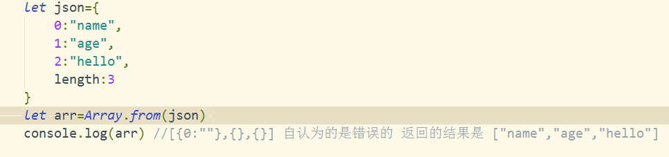
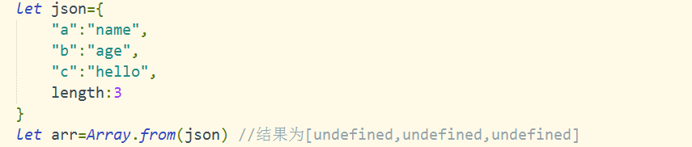
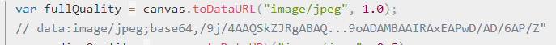
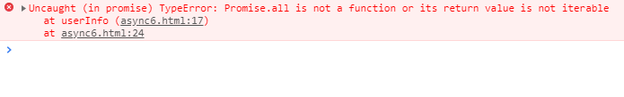
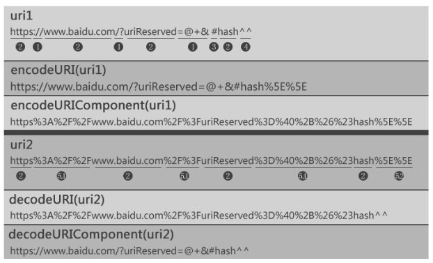
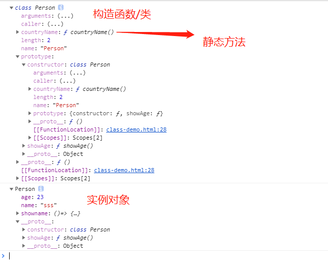

### Octal literals are not allowed in strict mode

~~~css
JS严格模式禁止使用八进制字面量，在我的数组中id使用了0，老的八进制（0前缀）
arr=[
{id:01,name:'aaa',age:23},
{id:02,name:'aaa',age:23},
{id:03,name:'aaa',age:23}
]
去掉0

~~~

### 秒转时分秒

#### toUTCString() toGMTString() toString()

~~~css 
toUTCString()和toGMTString()
由于目前UTC已经取代GMT作为新的世界时间标准，使用toGMTString()和toUTCString()两种方法返回字符串的格式和内容均相同
toString() 返回的是 '中国标准时间'
~~~

~~~javascript
var itime=9045
let h=Math.floor(itime/3600)
let m=Math.floor(itime%3600/60)
let s=Math.floor(itime%3600%60)
h=h>=10?h:'0'+h
m=m>=10?m:'0'+m
s=s>=10?s:'0'+s

~~~

### ES6中的Array.from（）方法

> + 针对{ }对象类型的转换方式
>
>   + ｛｝中有length属性的并且key值是数字的，转换后的数据格式为数组
>
>     
>
>   + ｛｝中没有length属性时 但是key是数字，转成空数组 【】
>
>   + { }中有length 但是key没有数字，而是字符串时，数组为的值为[undefined,undefined。。。]
>
>     

### canvas

#### 用来做擦除的方法

+ globalCompositeOperation

  ~~~javascript
  destination-out 新画的图型是用来擦除原有的图
  destination-in
  destination-over 
  
  xor
  source-over 
  ~~~

+ canvas.toDataURL()  返回的是一个带有图片格式的数据信息

  

+ closePath()

  > cxt.fill() 不需要使用closePath()的封闭
  >
  > cxt.stroke() 是需要closePath()的封闭的顺序是 cxt.stroke() ; cxt.closePath()

### navigator

#### navigator.mediaDevices.getUserMedia(constraints)

> 获取媒体设备的能力 ，constraints是约束媒体流的
>
> ~~~javascript
> let constraints={audio:true,video:{width:num,height:num}}
> 
> navigator.mediaDevices.getUserMedia(constraints) 返回的是Promise对象
> 直接使用 .then()的方法取值
> ~~~
>

### 浏览器自带的浏览器调试工具修改代码直接关联到文件并保存到本地

> + 目前只能做到 把本地的文件在浏览器中修改后同步保存
>   + 方法： add folder to workplace
> + 服务器的文件暂时无法做到同步修改后保存到本地

### async/await

> 
>
> + promise.all 是并行执行异步操作  跑的慢的为结束标准
> + promise.race 是并行执行异步操作   跑的快的为结束标准 结束后不在执行resolve 

###  **encodeURI() 函数可把字符串作为 URI 进行编码** 

+  encodeURI是对整个uri进行编码的，而encodeURIComponent是对uri中部分内容进行编码。 
+ 

### git  问题(Non-fast-forward)的出现原因是: git仓库中已有一部分代码, 它不允许你直接把你的代码覆盖上去。于是你有2个选择方式: 

~~~javascript	
1. 强推，即利用强覆盖方式用你本地的代码替代git仓库内的内容: git push -f

2. 先把git的东西fetch到你本地然后merge后再push

    - $ git fetch
    - $ git merge

这2句命令等价于

$ git pull 
~~~

### ECMA 语法

#### switch case 使用范围的方法

~~~css

~~~

#### requestFrameAnimation的停止方法

~~~css
this.stopID=window.requestFrameAnimation(函数名)调用后会返回一个唯一的ID值
window.cancelAnimationFrame(this.stopID) 就会停止动画
~~~

#### new FormData()的使用方法

~~~css
//获得页面当中的form表单元素
var form=document.querySelector("#form");
//将获得的表单元素作为参数，对formData进行初始化
var formdata=new FormData(form);

使用 formdata.get('name') input中的name属性
get(key) 获取
set(key,value) 修改
append(key,value) 末尾添加
delete(key) 删除
has(key) 判断

遍历的方法为 for(let temp of formdata){}
~~~

#### DOMContentLoaded事件和loaded区别

~~~css
DOMContentLoaded是在html解析完文档时触发：
	1.如果文档中没有脚步，那么就在解析完dom树和css样式后触发
	2.如果文档中有脚步，那么会脚步出阻塞，在解析完脚步和css dom后触发
DOMContentLoaded是不需要等待图片等其他资源的加载完成
loaded 不一样，是在所有资源加载完成后触发，页面上所有的资源（图片，音频，视频等）被加载以后才会触发load事件，简单来说，页面的load事件会在DOMContentLoaded被触发之后才触发。
~~~

#### 内存泄漏

~~~css
内存泄露的意思是：动态分配的堆内存由于某种原因程序未释放或者无法释放，导致内存的浪费，而导致程序运行速度的减慢甚至系统的崩溃等严重后果
~~~

#### 正则 replace的回调函数的匹配方法

~~~css
str.replace(/[<>&]*/gi,function(match){
    //match为匹配到的的字符串
    switch(match){
        case '<':
        	return '&lt;'
       	case ">":
			return "&gt;"
    }
})
~~~

#### prop和attr的属性区别

~~~css
prop使用时针对html标签固有的属性 如 title value 等
attr使用时针对 html的自定义的属性名 
具有true/false的属性值 的属性名如 disabled checked selected 时使用 prop

<input type="text" name="username">
使用原生js在input发生变化后获取值的 结果
input.value='你输入的当前值'
input.getAttrbuite('value') 为null

在使用jquery时
$('input').prop('value')显示的是发生变化的值
$('input').attr('value')显示的是undefined 
~~~

#### 函数的节流

~~~js
函数节流的意思是：在一段时间内，核心代码块只执行一次
优化高频率执行js代码的方法
应用场景：上啦加载更多 滚动浏览器滚动条的时候

节流：连续触发的事件，在一定时间内只有第一次触发，其他时间不触发
~~~

#### 函数防抖

~~~js
事件保持触发，一定事件内没有触发
核心：在一定时间内连续的函数调用，只让其执行一次
防抖：连续触发的事件，在一定时间内不触发，到达设定的时间后执行一次，即只有最后一次有效，其他触发没有效果
应用场景： 搜索框
用户停止输入的时候才去触发查询的请求，这时候函数防抖可以帮到我们。
~~~

#### Symbol 新数据类型

~~~css
typeof 的结果为 "symbol"
用法：let n=Symbol('sss')
这样就定义了一个 Symbol('sss')的常量 
常用来做 私有变量的 key值
function Person(name,gender){
    this.name=name;
    this[Symbol('gender')]=gender
}
let per=new Person('tom','male')
调用不到gender的属性值
~~~

#### 字符串模板

~~~css
unicode的使用方法
console.log('\u{1F603}') emoji地址：https://unicode.org/emoji/charts/full-emoji-list.html
或者 console.log(`\u{1f603}`)

~~~

#### Object.defineProperty

~~~js
let options={title:"sss"}
Object.defineProperty(options,'title',{
    configurable:true,//是否可以删除当前属性，默认为false
    value:'nothing seek,nothing find',
    writable:true,//value值是否可以改变，默认为false
    enumerable:true//是否可以用for in Object.keys()等方式遍历
})
~~~

### jsonp的使用方法

~~~css
第一种  创建标签的使用方法
function createJSONP(wd){
    let script=document.createElement('script')
    srcipt.src=`http://suggestion.baidu.com/su?wd=${wd}`
    document.body.appendChild(script)
    script.addEventListener('load',(ret)=>{
        document.body.removeChild(script)
    })
}
function callback(ret){
    console.log(ret)
}

第二种 jquery 和ajax配合使用
$.ajax({
    url:'http://suggestion.baidu.com/su?',
        data:{wd:''}//传入的参数
    type:'get',
    dataType:"jsonp",//服务器返回的数据类型为 jsonp 有回调函数的名称,
    jsonp:'callback的函数名==》在前端本地的自己定义的函数名称'//window.baidu.sug
    jsonpCallback:"window.baidu.sug"
})
//在使用$.ajax的请求方式时，error和success是使用不到的

window.baidu={
    sug:function(ret){
        console.log(ret)
    }
}
~~~

### ES6 数组方法

~~~javascript
arr.forEach((item,index,arr)=>{})
arr.map((item,index,arr)=>{ ...  return{}})//做映射改变原数据
arr.filter((item,index,arr)=>{ return ....}) //
arr.find((item,index,arr)=>{return })//返回最先符合条件的一个
arr.findIndex()
Array.from()
~~~

### ES6中的目前只有静态方法没有静态属性

~~~css
即只支持 static 方法（）{}
而类的静态属性
~~~

#### 类中的extends super

~~~css
当调用了extends时，就是完整的复制了一个父级类
的属性和方法

在子类的constructor中调用了super()方法表示的是调用父类的constructor()

super这个关键字，既可以当作函数使用，也可以当作对象使用。两种情况完全不同。

1.当作函数时，代表父类的构造函数。子类的构造函数必须执行一次super函数
这时的super()相当于 A.prototype.constructor.call(this)

2.super作为对象时，指向父类的原型对象。
	super.print() 

super在使用的时候，必须显示的指定是作为函数还是对象使用，否则会报错
	console.log(super)//报错
~~~

#### static 关键字 类的静态方法

~~~css
类相当于实例的原型，在类中定义的所有方法，都会被实例继承，但是在方法前加上 static关键字， 就表示该方法不会被实例继承，而是直接通过类来调用，这就是静态方法
~~~

### 延时执行的方法

~~~css
function sleep(time){
    return new Promise(resolve=>{
        console.log('222')
        setTimeout(resolve,time)
    })
}

(async function(){
    console.log('111')
    await sleep(2000);
    console.log('333')
})();
~~~

### ES6的module加载实现

~~~css
传统浏览器支持脚步的异步加载

这两种的区别是：下载完成后的执行时间不同
defer:执行时间是 在DOMContentLoaded之后执行：即在DOM结构渲染和其他同步执行的脚步加载完成后执行
async:执行时间是 在下载完成后立即执行

ES6的模块加载方式是
外联的方式是

内联的方式是

type="module" 也是异步的加载 效果等同于 defer

~~~

### webpack 的是使用

~~~css
1.在webpack中使用css-loader style-loader less-loader时 注意 加载导入的文件路径问题
	文件路径一定要以（./.../.../）
2.loader 使用规则：下载 使用（use）
	要使用多个loader时 使用关键字 ‘use’
	使用单个loader时 使用 loader:''
3.plugins 使用规则：下载 引入 使用

~~~

### blob:javascript的对象类型

~~~css
Blob对象表示一个不可变、原始数据的类文件对象
创建方式：
	new Blob(array,options)
如：new Blob(['<a>ssss</a>'],{type:"text/html"})
返回的数据:Blob(25){size: 25, type: "text/html"}

可以使用 FileReader 借口从 blob 读取数据，也可以使用 URL.createObjectURL() 从 blob 创建一个新的 URL 对象
~~~

