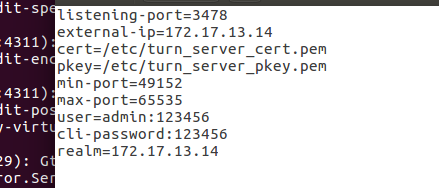

# 	一级标题

> 引用内容1

> 引用内容2
>
> > 引用内容3
> >
> > helloworld >空格+书写的内容就是引用格式的书写方法
>
> ##### 世界那么大，我想去看看

`string str1="hello;"单行代码的引用方法  用"``的反向单引号就好"`

`我是那个渺小的存在，不存在于过去，将来也不会留下什么`;

~~~javascript
let a=123;
function show(){
    console.log(a)
}
show()

~~~

~~~javascript
//这是javascript的代码展示区域
//箭头函数
/*
多行的注释
*/
写入代码区域的方法：~~~后面加上语言
~~~

#### 列表

##### 无序列表

* 无序列表1
* 无序列表二 使用方法为：*空格+文字即可

+ 无序列表3 的使用方法 ：+空格+文字就好

- 无序列表4的使用方法 ： -空格+文字就好

##### 多行无序列表

* 多行无序列表
  * * 多行无序列表2
    * 多行无序列表3
    * 首发打对方

* 多行无序列表的使用方法 *tag后面加文字 
  * 即可的交罚款 的会计法快递费
  * 受到发达啥的积分卡
    * 受到罚款的积分开始f 也可以在*tagtag后面加文字

##### 有序列表

1. 有序列表的使用方法 数字1.空格后面加文字
2. 按enter键后自动就是有序列表
3. 这是效果

##### 多行有序列表

1. 多行有序列表的使用
   1. 和多行无序列表的使用方法一样 数字1.tag+文字就好
      1. 也可以使用1.tagtag的格式

##### 任务列表

- [ ] 抽烟
- [ ] 喝酒
  - [ ] 烫头阿萨德积分卡京东方山东发		
    - [ ] ​	使用方法为 -空格[空格]空格文字
- [ ] 使用方法-空格[空格]空格文字说明

#### 表格

| 姓名 | 年龄 | 性别 | 手机号 |
| ---- | ---- | ---- | ------ |
|      |      |      |        |

`使用表格的第一种方法：|text|text|text|回车键`

| :--d | :--- | :--- | :--- |
| ---- | ---- | ---- | ---- |
|      |      |      |      |

`第二种方法：|:---|:---|:---|:---|回车键`

| 张三 | 23   | 男   | 17323446745 |
| ---- | ---- | ---- | ----------- |
|      |      |      |             |

| name | age  | gender |
| ---- | ---- | ------ |
|      |      |        |

## 	二级标题

### 链接

#### 图片

#### 超链接

[百度][https://www.baidu.com] [http://www.baidu.com]

`参考式链接`

[CSDN][csdn网址]

`自动链接`<https://github.com>

### 三级标题

#### 斜体

`加粗的方法：`**加粗的文字**

~~~javascript
加粗的使用方法为：**加粗的文字**
~~~

#### 下划线

<u>下划线的使用方法</u>

`在 <u>标签中写入</u>`

#### 删除线

~~这是删除的效果~~

`使用的方法为：~~要删除的文字说明~~`

#### 分隔线

***

---

___

`使用方法为：***或者---`

#### 脚注

这就是脚注[^1].

[^1]: 这是脚注内容

脚注的使用方法[^font]

[^font]:sdfaldfj

~~~javascript
使用的方法为:[^脚注名称]
换行
[^脚注名称]:冒号一定要有 后面加上说明文字
~~~

#### 四级标题

##### 五级标题

###### 六级标题及

### 生成项目的目录结构图方法

+ cd 到当前的项目根目录下
+ tree /f > 文件名.txt

#### 生成的文件名 统一命名方法

~~~css
文件名-作用-作用.[扩展名]
文件夹：大类别的使用 名词 【单个】
嵌套的文件夹使用 文件的名称方式 配合-
~~~

### ` 打开chrome浏览器中的隐藏功能`

~~~css
浏览器地址栏输入并打开 chrome://version，页面显示了当前浏览器版本的详细信息
输入 chrome://flags，这个命令将打开 Chrome 浏览器的功能特性界面，我们可用来启用或者关闭某些 Chrome 的实验功能。
输入 chrome://settings 将快速打开 Chrome 浏览器的设置页面
输入 chrome://net-internals 后打开一个显示网络相关信息的页面
chrome://downloads：直接访问 Chrome 浏览器网页下载的文件。
chrome://history：直接访问 Chrome 浏览器访问的历史记录。
chrome://apps：访问 Chrome 浏览器中安装的应用的界面，可以对应用进行删除管理。
chrome://bookmarks：直接访问 Chrome 浏览器中我们收藏的标签。
chrome://dns：显示浏览器预抓取的主机名列表，让用户随时了解 DNS 状态。
chrome://devices：查看连接电脑的设备，比如传统打印机中，可设置添加打印机到 Google 
~~~

### 操作系统的通道含义

~~~css
1.传输信息的数据通道
2.计算机中传输信息和数据的装置，主要有主存储器读写通道和输入、输出通道。能接受中央处理机的命令，独立执行通道程序，协助中央处理机控制与管理外部设备

一个独立于CUP的专门IO控制的处理机，控制设备与内存直接进行数据交换。它有自己的通道命令，可由CPU执行相应的指令来启动通道，并在操作结束时项CPU发出中断信号。通道指令的格式一般为：操作码，记数段，内存地址段，结束标志组成。一个系统中可以设立三种类型的通道：字节多路通道、数组多路通道、选择通道。
~~~

### 计算机知识点

~~~css
测试时返回的IP地址为： ::1说明你的电脑开启了ipv6支持，这个IP表示ipv6下的本地回环地址，因为你访问的时用的是localhost访问的
~~~

#### 物理引擎

~~~css
通过为刚性物体赋予真实的物理属性的方式来计算运动、旋转和碰撞反映。为每个游戏使用物理引擎并不是完全必要的--简单的牛顿物理（如加速和减速）也可以通过编程或脚本来实现。然而，当游戏需要比较复杂的物体碰撞、旋转、滚动、滑动或者弹跳的时候（如赛车保龄球等游戏），通过编程的方法就比较困难了。

物理引擎使用对象属性（动量、扭矩、弹性）来模拟刚性物体行为，不仅可以得到更加真实的结果，对于开发人员来说比编程行为脚本更容易掌握。
~~~

### github的开源项目查找方法

+ 搜索栏中输入： in:name nodejs stars:>1000 
+ 搜索栏中输入：in:readme nodejs stars:>1000 
+ 搜索栏中输入：in description 微服务 language:javascript pushed:>2019-09-03
#### .gitignore文件中的匹配父含义

~~~js
1.过滤规则：
    /mtk/ 过滤整个文件夹
    *.zip 过滤所有的.zip文件
    /mtk/do.c 过滤do.c的文件
2.添加到版本管理中
	！src/ 不过滤src文件夹
	！*.zip 不过滤所有的.zip文件
	！/mtk/do.c 不过滤 mtk/do.c的文件
配置规则
	/ 斜杠 表示目录
	* 星号 配多个字符
	？问号 通配单个字符
	[] 方括号 包含单个字符的匹配列表
	！叹号 表示不忽略不过滤匹配到的文件或目录
git对于gitigonre的匹配文件的匹配规则是按行从上到下的规则进行匹配的，意味着前面的范围更大时，后面的规则不会生效

fd1/* //过滤到根目录下所有 包含 fd1目录的 包含目录下的所文件都会忽略
/fd1/*  忽略根目录下的 /fd1/ 目录

~~~

### nodejs express框架插件

~~~css
svg-captcha //图片验证码
art-template/express-art-template //html的引擎
body-parser
express
cros //跨域解决方案
cherrio//正则插件
nodemailer//邮箱插件
multer
crusf
cookie-parser
express-session
connect-redis//需要和redis,express-session配合使用
	const redis=require('redis')
	const session=require('express-session')
	const RedisStore=require('connect-redis')
	let client=redis.createClient()
app.use(session({
    secret:"your secret string",
    resave:false,
    saveUninitial....,
        store:new RedisStore({client:client})
}))

passport：第三方登陆验证
~~~

### nodejs koa框架 插件

~~~css
koa
koa-static
koa-router 
//router=require('koa-router'();
//app.use(router.routes());启动路由
//app.use(router.allowedMethods()); 在http请求options方法是 在请求头 allow 会显示所有的路径下所有定义的请求方法（get,post,patch，put,delete）2.错误提示 405（没实现）501（不允许）

art-template
koa-art-template

//static
app.use(static(path.join(__dirname,'public')))
//模板渲染
render({
    root:path.join(__dirname,'views'),
    extname:'.html',//文件后缀名
    debug:true||process.env.NODE_ENV!=='production'
})

koa-bodyparse
//用法
const bodyParser=require('koa-bodyparser')
app.use(bodyParser()) 提前使用
//post提交的信息存储在cxt.request.body中，空时body=｛｝
koa-body 和koa-bodyparse的区别就是koa-body支持multipart/form-data

koa-json-error 
jsonError({
    postFormat:(e,{stack,...rest})=>{
        return process.env.NODE_EVN==='production'?rest:{stack,...rest}
    }
})

~~~

### electron 插件

~~~js
electron-rebuild //编译原生的模块 
robot.js//智能自动化 控制鼠标、键盘、阅读屏幕
vkey //根据键值找对应的键盘字母
mousetrap
node-ffi//node版本低于10
ffi-napi //node版本大于10
electron-is-dev
electron-notification-state //检测是否可以使用通知

electron-progressbar //提供了一个易于使用且高度可定制的API来显示和控制电子应用程序的进度条。
electron-window-state //用于存储和恢复电子应用程序的窗口大小和位置的库

highlight.js //Web的语法高亮
	hljs.initHighlightingOnLoad();
	hljs.highlightBlock(DOM节点)
js-yaml  //是专门用来写配置文件的语言，非常简洁和强大，远比 JSON 格式方便。
jszip //一个用JavaScript创建、读取和编辑.zip文件的库，带有一个可爱而简单的API。
lodash //Lodash是一个著名的javascript原生库，不需要引入其他第三方依赖。是一个意在提高开发者效率,提高JS原生方法性能的JS库。简单的说就是，很多方法lodash已经帮你写好了，直接调用就行，不用自己费尽心思去写了，而且可以统一方法的一致性。Lodash使用了一个简单的 _ 符号，就像Jquery的 $ 一样，十分简洁。
pretty-bytes //- 将字节转换为一个人类可读的字符串:1337→1.34 kB
randombytes
docxtemplater //您将能够使用Word本身来自定义生成的文档。 收费的
docx-templates //为Node和浏览器创建基于模板的docx报告
remove-markdown //将文本中删除（剥离）markdown格式。
    const plainText=removeMd(markdownstr,{
		stripListLeaders:true,//删除列表定义符 设置stripListLeaders为false将保留所有列表字符（*, -, +, (digit).）。
        listUnicodeChar:"",//要插入的char而不是剥离的列表前导符
        gfm:true,//GitHub的markdown语法在标准的markdown语法基础上做了扩充，称之为GitHub Flavored Markdown
        useImgAltText:true	将图像替换成alt-text
    })
sax //此种方式可以非常方便的获取行号信息，很容易对XML定位出错，对于前端XML编辑器，对XML数据进行校验，定位到出错行非常方便。

create-torrent//创建种子文件
semver //semver 是 语义化版本（Semantic Versioning）规范 的一个实现，目前是由 npm 的团队维护，实现了版本和版本范围的解析、计算、比较。
showdown // html到md格式 或者 md到html格式转换

v-emoji-picker //是一个轻型表情符号选择器，可以在选择器组件中显示原生表情符号
string-replace-to-array //字符串替换为数组
	var replace = require('string-replace-to-array')
	replace('Hello Amy', 'Amy', { name: 'Amy' })
	// output: ['Hello ', { name: 'Amy' }]	

turndown //使用js方法将html转成markdown
winston //winston被设计为一个简单且通用的日志库，支持多种传输。传输实质上是日志的存储设备
application-config//将应用程序配置存储在操作系统希望的位置。
auto-launch //登录时自动启动您的应用。
debounce //重新渲染函数
	var debounce = require('debounce');
    window.onresize = debounce(resize, 200);

    function resize(e) {
      console.log('height', window.innerHeight);
      console.log('width', window.innerWidth);
    }

drag-drop //文本拖拽
languagedetect //语言检测，返回的是数组 按照分数排序
music-metadata //用于node.js的基于流和文件的音乐元数据解析器
network-address//本机地址的网络地址
run-parallel//并行运行一系列功能
electron-progressBar //进度条
    let progressBar=new ProgressBar({
            indeterminate:false,
            text:"Preparing data...",
            detail:"wait...",
            browserWindow:{
                webPreferences:{
                    nodeIntegration:true
                }
            }
        })
    
winston //简单通用的日志库
electron-debug //在生产环境下 按F12可以直接打开控制台
javascript-state-machine//状态模式的一个模型，在日常开发中很多具有多种状态的对象，都可以用有限状态机模型来模拟
	应用场景：红绿灯
    const StateMachine = require('javascript-state-machine');
    var fsm = new StateMachine({
        init: 'green',
        transitions: [
          { name: 'warn',  from: 'green',  to: 'yellow' },
          { name: 'panic', from: 'yellow', to: 'red'    },
          { name: 'calm',  from: 'red',    to: 'yellow' },
          { name: 'clear', from: 'yellow', to: 'green'  }
        ]，
        methods: {
          onWarn: function() {},
          onBeforeWarn: function() {},
          onLeaveWarn: function() {},
          onEnterYellow: function() {},
          onLeaveYellow: function() {},
          //...
        }   
    })
    有限状态机
    优点:
        一个状态状态对应行为，封装在一个类里，更直观清晰，增改方便
        状态与状态间，行为与行为间彼此独立互不干扰
        避免事物对象本身不断膨胀，条件判断语句过多
        每次执行动作不用走很多不必要的判断语句，用哪个拿哪个
        
jsonfile//在Node.js中轻松读取/写入JSON文件。注意：该模块不能在浏览器中使用。
open//可以替换掉本地的 shell.openPath()
parse-filepath //文件路径转成对象
mime//紧凑的MIME类型模块。
glob //glob是shell使用的路径通配符,类似于正则表达式,但是与正则表达式不完全相同,在linux操作中如文件匹配等等已经使用了glob通配符;
deep-equal//深度对比 是否相等
    var equal = require('deep-equal');
    console.dir([
        equal(
            { a : [ 2, 3 ], b : [ 4 ] },
            { a : [ 2, 3 ], b : [ 4 ] }
        ),
        equal(
            { x : 5, y : [6] },
            { x : 5, y : 6 }
        )
    ]);

deep-extend//和Object.assign相同的作用，不同是深度合并

codemirror //在线支持语法高亮的代码编辑器

chokidar//监视文件或文件夹 chokidar将在指定路径范围内的所有内容上递归启动监视程序
celldown.js //快速创建表格
ioredis //redis的超级 有发布订阅功能
xterm //Xterm.js是一个用TypeScript编写的前端组件，它允许应用程序在浏览器中为用户提供功能齐全的终端。它被VS Code，Hyper和Theia等热门项目所使用。
fs-extra//fs的超级
ora//使用Node.js制作命令行工具时，您可能会使用Vorpal或commander之类的东西。当您想与用户交流时，她需要等待，您可以做很多事情。您可以显示一个进度条
howler//一个现代音频库，支持 Web Audio API 和 HTML5 Audio 的回退机制。该项目致力于简化与使用 JavaScript 开发跨平台音频相关的开发工作。
siriwave//使用Canvas API在纯Javascript中复制了“ Apple Siri”波形。
shortid//简短的非顺序url友好型唯一ID生成器。  JJrieEfeJ
annyang//一个很小的javascript SpeechRecognition库，可让您的用户通过语音命令控制您的网站。
cheerio//Cheerio实现了核心jQuery的子集。
electron-settings
electron-storage
electron-json-storage
electron-store
humanization-duration//人性化的显示时间 如12000=》 12秒
normalize.css //CSS重置的现代替代方法
adm-zip//解析zip和从新压缩zip文件
baron//小型，快速，跨浏览器自定义滚动条。
dompurify //DOMPurify清理HTML并防止XSS攻击。
electron-notarize //-save-dev 为macOS无缝地对您的Electron应用进行公证
mocha //mocha是一个功能丰富的javascript测试框架
node-stream-zip //用于读取和提取ZIP存档的node.js库。
pikaday// 轻量级的 javascript日期选择器 
prettier//Prettier的中文意思是“漂亮的、机灵的”，也是一个流行的代码格式化工具的名称，它能够解析代码，使用你自己设定的规则来重新打印出格式规范的代码。
nprogress//页面加载进度条
ansi-to-html//终端格式/颜色代码转成html的库
numeral//数字可以格式化成货币、百分比、时间，甚至是带有小数点、千分位和缩写。
	numeral(1000).format('0,0') 1,000
request-progress//跟踪与请求一起发出的请求的下载进度，从而洞察各种指标，包括进度百分比，下载速度和剩余时间。
filesize//提供了一种简单的方法来从数字（浮点数或整数）或字符串中获取人类可读的文件大小字符串。
walker//一个nodejs目录遍历器。
ssejson//使用sse协议连接是 服务器向浏览器发送的数据格式解析
htmltable
csv-parser//解析.csv的文件格式数据
log-rotate//日志切割
through//快速创建一个双向流，相比stream模块 through更方便
array-union//从输入的数组中创建一个唯一值不重复的数组 arrayUnion （[ 1 ，1 ，2 ，3 ] ，[ 2 ，3 ] ） =>[1,2,3]
brace//在HTML页面中构建不同类型的编辑器（javascript/json/coffee）
bulk-require//加载文件的列表输出
decibels//音量分贝之间来回转换值
insert-css//将css字符串插入<head>
json-query//从json对象检索值以进行数据绑定。提供参数、嵌套查询，深层查询，自定义化简/过滤函数和简单的布尔逻辑
ncp//异步递归文件和目录复制
notevil//与内建类似eval，将返回最后一个表达式的结果
	const safeEval=require('notevil')
    let ret=safeEval('1+f(2,3)+x',{
        x:100,
        f:function(a,b){
            return a*b
        }
    })
pseudo-audio-param//模拟预定的audioiParam值
pull-cat
pull-stream//从源流的顺序列表构造一个新的源流，依次从每个流中读取直到结束，然后依次读取
readable-blob-stream//read w3c Blob & File objects as a Node stream
scroll-into-view//滚动到视图
strftime//时间日期格式化
getport//找一个开放的端口监听
passport//express兼容身份验证中间件。目的是对请求进行身份验证，通过策略插件来完成，策略可扩展
minimist//用来解析命令行选项的库
fstream//像FS流一样，但是带有统计信息，并支持目录和符号链接以及普通文件
tar//
carto//CartoCSS简称Carto是一种地图设计语言。语法与css相似
progress-stream//查看或阅读流的进度
electron-in-page-search//使用chrome的页内搜索功能
rc//读取全局的配置模块
user-home//获取用户主目录的路径
tree-kill//杀死进程树中的进程，包括根进程。
adbkit//android debug dridge 安卓平台调试桥，是连接android手机和pc端的桥梁，通过adb可以管理、操作模拟和设备，如安装软件、查看设备软硬件参数、系统升级、运行shell命令等。adbkit具有上面大多数的功能外，并添加了一些附加功能，例如能够生成触摸/按键事件和截图。
node-notifier//跨平台本地通知
tildify//绝对路径转成波浪线路径
sfx//在节点程序中的声音效果提供一个简单，一致，跨平台的api.想要在节点程序完成执行时发出通知吗？您的程序遇到错误时会发出蜂鸣声吗？您是否曾经想过读出您的错误消息？node-sfx是给你的。
bitcrusher//使用Web Audio API实现位压缩效果。
dotenv//将环境变量从 .env文件加载到process.env。
jimp //javascript图像处理程序
mkdirp//递归创建目录
univeral-analytics//通用分析插件，结合 google analytics(分析)提供的各种API，帮助你收集、配置及报告用户与您的网络内容进行互动的数据
wallpaper//设置或者获取桌面墙纸
awaitqueue //异步队列机制去顺序执行需要互斥的的代码
medooze//webrtc流媒体服务器
mediasoup //流媒体服务器
protoo-server// 多方实时通信应用程序的极简且可扩展的Node.js信令框架
usb //usb通信和插拔监听
usb-hid  //hid设备是直接与人交互的设备，例如鼠标，键盘，游戏杆 HID是一种USB通信协议，无需安装驱动就能进行交互
~~~

### meta 

~~~css
如果使用的是windows，那么meta键表示的就是键盘上的win键（及键盘上有窗口图案的键）

如果使用的是苹果电脑，meta键表示的是Cmd键；
~~~

### 虚拟机的操作

+ 在windows系统中使用FTPL连接 虚拟机 

  ~~~css
  1.安装vsftpd
  2.配置vsftpd.conf
  3.安装sudo apt install firewalld
  4.开启firewalld的服务 sudo firewall-cmd --state
  5.开启http服务 sudo firewall-cmd --add-service=http --permanent
  5.开启20、21端口 sudo firewall-cmd --add-port=20/tcp --permanent
  6.客户端使用 filezilla 软件 连接方式 ：
  			加密：选择 普通的ftp(不安全)的
  	在传输设置：传输协议 选择 主动模式
  	
  ~~~

### 安装addroid SDK inter HAMX 报错

~~~css
bois页面中 virtualization Technology  启用
windows+x ->程序和功能 ->启用或关闭windows功能 ->Hyper 前的钩取消掉
~~~

### 串口、COM口

~~~css
串口、COM口一般指物理接口形式。 TTL\RS-232\RS-485是指电平标准(电信号)
串行通信端口，简称串口，区别于usb的通用串行总线和硬盘的 sata
串口标准一般有两种：D型9针 4针杜邦
~~~

### USB接口通信

#### usb-hid

~~~css
HID是一种USB通信协议，无需安装驱动就能进行人机交互,例如鼠标、键盘、游戏杆
~~~

#### usb设备描述符

~~~css
插入usb后主机会向设备请求各种描述符来识别设备。
Descriptor即描述符，是一个完整的数据结构。
描述符的作用就是通过命令操作来给主机传递信息，从而让主机知道设备具有什么功能，属于哪一类设备，要占多少宽带、使用哪种类型传输方式及数据量的大小

usb有5中描述符：设备描述符、配置描述符、字符描述符、接口描述符、端点描述符
一个设备只有一个设备描述符，而一个设备描述符可以包含多个配置描述符，而一个配置描述符可以包含多个接口描述符，一个接口使用了几个端点，就有几个端点描述符

bLength				设备描述符的字节数大小
bDescriptorType		描述符类型编码
bcdUSB				usb版本号
bDeviceClass		USB分配的设备类代码，0x01~0xfe为标准设备类，0xff为厂商自定义类型，0x00不是设备描述符中定义的，如hid
bDeviceSubClass		USB分配的子代码，同上，值由USB规定和分配，hid设备此值为0
bDeviceProtocl		USB分配的设备协议代码，hid设备值为0
bMaxPacketSize0		端点0的最大包的大小
idVendor			厂商编号
idProduct			产品编号
bcdDevice			设备出厂编号
iManufacturer		描述厂商字符串的索引
iProduct			描述产品字符串的索引
iSerialNumber 		描述设备序列号字符串的索引
bNumConfiguration 可能的配置数量

~~~

### 树莓派和Arduino的区别

~~~css
Arduino是一个单片机，而树莓派是一台功能齐全的计算机。
Arduino没有操作系统，树莓派可以跑Linux
~~~

### IOT框架 物联网框架

~~~css
设备如何接入网络
设备间如何通信
物联网数据如何用途
如何搭建一个物联网系统框架？技术架构又是怎么样
物联网终端软件系统架构
物联网平台系统架构

只有设备接入到网络里面，才能叫物联网设备。
接入方式：
	1.直接接入：本身具备联网能力
	2.网关接入：本身不具备联网能力，需要在本地组网后，需要统一通过网关再接入到网络。 常用到的本地无线组网技术：Zigbee,Lora,BLE MESH,sub-1GHZ等。

物联网设备里面，物联网网关一是个非常重要的角色。一个处在本地局域网与外部接入网之间的智能设备。主要功能就是网络隔离，协议转化/适配以及数据网内外传输

ROTS 实时多任务操作系统
~~~

#### 智能网关逻辑

#### 物联网平台架构

### ftp win7系统服务器远程的链接方法

~~~css 
win7的磁盘管理在 【计算机】右键 【管理】
win7 【控制面板】-【程序或功能】-【打开或关闭windows功能】
win7的 【控制面板】-【管理工具】中选择IIs中添加ftp服务器

1. 打开"控制面板->系统和安全->windows防火墙"

2. 点击左侧的"高级设置"

3. 在"出站规则"中, 启用与FTP server相关的一切规则

4. 在"入站规则"中, 在右侧点击"新建规则", 然后按照步骤一步一步操作, 开放端口21
~~~

### windows中重置 cmd的设置

~~~css
win+r 运行
regedit 注册表打开
HKEY_CURRENT_USER console =>删除带.cmd文件夹

设置cmd 显示中文乱码的问题
regedit 
如下图
~~~

### 服务器ubuntu

#### coturn 安装

~~~css
coturn服务器完整实现了stun/turn/ice协议，支持p2p穿透防火墙技术。主要用于webrtc点对点音视频通道

sudo apt-get update
sudo apt-get install coturn

//cert 和 pkey 这两个是配置如果要进行安全SSL连接用到的证书。

//https://www.cnblogs.com/lglh/p/12822179.html 具体步骤
listening-ip=内网地址
relay-ip=内网地址
external-ip=外网地址
server-name=外网地址
realm=外网地址
2、编辑/etc/turnserver.conf文件：

listening-port=3478
TURN为TLS的侦听器端口(默认: 5349)。
tls-listening-port=5349

listening-ip=192.168.1.230

external-ip=47.104.19.243（NAT必须）

lt-cred-mech

user=tcp:123456（必须）
realm=example.com（必须）

3、编辑/etc/default/coturn文件：
TURNSERVER_ENABLED=1（必须）
//重启coturn
service coturn restart
//测试ice的地址
https://webrtc.github.io/samples/src/content/peerconnection/trickle-ice/
~~~

#### coturn turnserver.config的默认配置

~~~css
listening-port=3478
external-ip=172.17.13.14
cert=/etc/turn_server_cert.pem
pkey=/etc/turn_server_pkey.pem
min-port=49152
max-port=65535
user=admin:123456
cli-password:123456
realm=172.17.13.14

~~~

#### firewall-cmd的操作方法

~~~css
所有的操作是在 sudo 超级管理员权限下设置的
1.添加 
firewall-cmd --add-port=80/tcp --permanent
2.删除
firewall-cmd --remove-port=80/tcp --permanent 
3.所有的有新操作时需要重新加载 reload
firewall-cmd --reload 
4.查看所有的开放的端口号
firewall-cmd --list-all

~~~

#### 免费的SSL证书Certbot 

### OpenSSL是一个开放源代码的软件包库

~~~css
应用程序可以使用这个包进行安全通信，避免窃听，同时确认另一端连接人的身份
参考地址：
https://blog.csdn.net/bbwangj/article/details/82503675
~~~

#### 基本功能

~~~css
SSL协议库、应用程序以及密码算法库
作为基于密码学的安全开发包，OpenSSL提供的功能相当强大和全面，攘括了主要的密码算法、常用的密码和证书管理功能以及SSL协议

建立RSA DH DSA key参数
建立X.509证书、证书签名请求(CSR)和CRLs（证书回收列表）
计算消息摘要
使用各种Cipher(密码)加密/解密
SSL/TLS客户端以及服务器的测试
处理S/MiME或者加密邮件
~~~

#### SSL和TLS的区别

~~~css
ssl在1999年的时候已经淘汰了，TLS协议取代了它，区别就是如何建立安全连接
但是SSL证书基本上成了业界的一个品牌名称。
~~~

#### Certbot安装方法

~~~css
https://www.kutu66.com/WebServers/article_184571
~~~

#### 基本操作

~~~css
1.RSA密钥操作
默认情况下，openssl输出的格式为 PKCS#1-PEM
	生成RSA私钥(无加密)
	openssl genrsa -out rsa_private.key 2048 
	
	生成RSA公钥
	openssl rsa -in rsa_private.key -pubout -out rsa_public.key

	生成RSA私钥（使用aes256）
	openssl genrsa -aes256 -passout pass:111111 -out rsa_aes_private.key 2048
	生成公钥，需要提供密码
	openssl rsa -in rsa_aes_private.key -passin pass:111111 -pubout -out rsa_public.key

2.生成自签名证书
生成RSA私钥和自签名证书
	openssl req -newkey rsa:2048 -nodes -keyout rsa_private.key -x509 -days 365 -out cert.crt
	req:证书请求的子命令，-newkey rsa:2048 -keyout rsa_private.key 表示生成私钥(PKCS8格式)，-nodes表示私钥不加密，若不带将提示输入密码；
	-x509表示输出证书，-days365为有效期，此后根据提示输入证书拥有者信息；
	若执行自动输入，可使用-subj选项：
	openssl req -newkey rsa:2048 -nodes -keyout rsa_private.key -x509 -days 365 -out cert.crt -subj "/C=CN/ST=GD/L=SZ/O=vihoo/OU=dev/CN=vivo.com/emailAddress=yy@vivo.com"

使用已有RSA私钥生成自签名证书
openssl req -new -x509 -days 365 -key rsa_private.key -out cert.crt
	-new 指生成证书请求，加上-x509表示直接输出证书，-key指定私钥文件

3.生成签名请求及CA签名
使用RSA私钥生成CSR签名请求
openssl genrsa -aes256 -passout pass:111111 -out server.key 2048
openssl req -new -key server.key -out server.csr
之后输入密码、server证书信息完成，也可以命令行指定各类参数
openssl req -new -key server.key -passin pass:111111 -out server.csr -subj "..." //同上

对请求签发证书进行签发，生成 x509证书
openssl x509 -req -days 365 -in server.csr -signkey private.key -out server.crt

~~~

#### 证书的形式

~~~css
1.带私钥的证书
	包含了公钥和私钥的二进制格式的证书形式，以.pfx作为证书的后缀名
2.二进制编码的证书
	证书中没有私钥，DER编码二进制格式的证书文件，以cer作为证书文件后缀名
3.Base64编码证书
	证书中没有私钥，base64编码格式的证书文件，也以cer作为证书文件的后缀名

pfx既可以导出pfx证书，也可以导出cer证书
cer证书不能导出pfx证书
~~~

#### 知识点

~~~css
对称加密：用同一个密码 加密/解密 文件
非对称加密：加密用一个密码，解密用另一个密码
加密解密：公钥加密，私钥解密
	公钥加密的数据只有到了有私钥解密的人手里才能解开成有效的数据

签名和验证签名：私钥加密数据，公钥解密
	用私钥进行数据签名，那这个数据就只有配对的公钥可以解开，有这个私钥的只有你，配对的公钥解开了数据，就说明这数据是你发的，这个被称为签名

加密的算法：RSA/DSA/SHA/MD5
RSA:可用于加密/解密，也可用于签名验证 非对称的
DSA:只能用于签名	非对称的
SHA和MD5:摘要算法
	就是通过一种算法，依据数据内容生成一种固定长度的摘要，这串摘要值与原始数据存在对应关系
	实际应用过程中,因为需要加密的数据可能会很大,进行加密费时费力,所以一般都会把原数据先进行摘要,然后对这个摘要值进行加密,将原数据的明文和加密后的摘要值一起传给你.这样你解开加密后的摘要值,再和你得到的数据进行的摘要值对应一下就可以知道数据有没有被修改了。
	实际应用中,一般都是和对方交换公钥,然后你要发给对方的数据,用他的公钥加密,他得到后用他的私钥解密,他要发给你的数据,用你的公钥加密,你得到后用你的私钥解密,这样最大程度保证了安全性.

CA/PEM/DER/X509/PKCS
	一般的公钥不会用明文传输给别人的,正常情况下都会生成一个文件,这个文件就是公钥文件,然后这个文件可以交给其他人用于加密,但是传输过程中如果有人恶意破坏,将你的公钥换成了他的公钥,然后得到公钥的一方加密数据,不是他就可以用他自己的密钥解密看到数据了吗,为了解决这个问题,需要一个公证方来做这个事,任何人都可以找它来确认公钥是谁发的.这就是CA,CA确认公钥的原理也很简单,它将它自己的公钥发布给所有人,然后一个想要发布自己公钥的人可以将自己的公钥和一些身份信息发给CA,CA用自己的密钥进行加密,这里也可以称为签名.然后这个包含了你的公钥和你的信息的文件就可以称为证书文件了.这样一来所有得到一些公钥文件的人,通过CA的公钥解密了文件,如果正常解密那么机密后里面的信息一定是真的,因为加密方只可能是CA,其他人没它的密钥啊.这样你解开公钥文件,看看里面的信息就知道这个是不是那个你需要用来加密的公钥了.

　　实际应用中,一般人都不会找CA去签名,因为那是收钱的,所以可以自己做一个自签名的证书文件,就是自己生成一对密钥,然后再用自己生成的另外一对密钥对这对密钥进行签名,这个只用于真正需要签名证书的人,普通的加密解密数据,直接用公钥和私钥来做就可以了.

CSR:证书签名请求
CRLs:证书回收列表
crt:是CA认证后的证书文件，签署人用自己的key给你签署凭证
	server.crt:最重要的是有一个common name，可以写你的名字或者域名。如果为了https申请，这个必须和域名吻合，否则会引发浏览器警报。生成的csr文件讲给CA签名后形成服务端自己的证书。

秘钥文件的格式用openssl生成的就只有PEM和DER两种格式，
PEM:是将秘钥用base64编码表示出来的，直接打开看到一串英文字母
DER：是二进制的秘钥文件
X509:是通用的证书文件格式定义
PKCS:指定的存放秘钥的文件标准

pem der x509 pkcs这几种格式是可以互相转换的

~~~

#### 生成证书

~~~js
1.创建私钥
openssl genrsa -out ca-key.pem 1024
2.创建证书请求 ：将私钥转成证书
openssl req -new -out ca-req.csr -key ca-key.pem
3.将证书请求转成证书
openssl x509 -req -in ca-req.csr -out ca.cer -signkey ca-key.pem -days 3650

ca.cer ca证书
~~~

#### 服务端生成正式

~~~js
server 证书: opsenssl genrsa -out server-key.pem 1-34 

~~~

### 无线链接的知识点

~~~css
RSSI:rssi
received signal strength indication接收的信号强度指示，无线发送层的可选部分，用来判定链接质量，以及是否增大广播发送强度。
通过接收到的信号强弱测定信号点与接收点的距离，进而根据相应数据进行定位计算的一种定位技术。
~~~

### 访问控制

~~~css
对于资源的访问控制是我们经常遇到的，当你规定某些数据只有某些人才可以访问和控制时，那就是访问控制。

访问控制可以看做是：
	规定用户/主体 通过某些 权限/规则 去操作某些 资源/客体
	用户/主体 subject
	权限/规则 permission/rule
	资源/客体 resource/object

权限/规则是一组规则的集合（规则引擎），当用户试图去访问某个资源时，就去这个规则集合中搜索和过滤，然后得出结果，看用户是否拥有这个权限去访问这个资源

权限的表现是什么？对功能模块的操作，对上传文件的删改，菜单的访问，页面上某个按钮、某个图片的可见性控制，都是权限范畴。

功能操作作为一类
文件、菜单、页面元素等作为另一类。
这样构成了 用户-角色-权限-资源 的授权模型
建表时把功能操作和资源统一管理，就是都直接和权限表进行关联：如图

请留意权限表中有一列“权限类型”，我们根据它的取值来区分是哪一类权限，如“MENU”表示菜单的访问权限、“OPERATION”表示功能模块的操作权限、“FILE”表示文件的修改权限、“ELEMENT”表示页面元素的可见性控制等。
~~~

#### 常见的控制模型

~~~css
访问控制列表 （acl:access control list）
自主访问控制 （dac:discretionary access control）
强制访问控制 （mac:mandatory access control）
基于角色的访问控制 （rbaca:role-based access control）
基于属性的访问控制 （abac:attribute-based access control）
~~~

#### acl 模型

`访问控制列表就是用一个列表的形式来维护对某个资源的访问控制，把人直接和权限对应起来`

| name  | create | read | update | delete |
| ----- | ------ | ---- | ------ | ------ |
| alice | 1      | 1    | 0      | 0      |
| bob   | 1      | 1    | 1      | 0      |
| tom   | 1      | 1    | 1      | 1      |

~~~css
优点：
很直观
实现简单

缺点：
	维护成本高，用户多时基本很难维护
	无法批量修改用户权限
	冗余数据多
acl模型演化出了 基于角色的访问控制模型

~~~

#### dac:自主访问控制

`DAC是指资源的拥有者可以将其拥有的权限分配给其他用户。 大多数的NUIX系统的访问控制模型就是DAC`

#### mac:强制访问控制

`mac是指所有的访问控制策略都有系统管理员来指定，用户无法改变`

~~~css
mac一般会给用户和资源进行分级
	用户级别：高级、中级、普通
	文件级别：绝密、保密、公开
系统管理员会指定访问策略，比如高级用户可以访问所有类型的文件，中级用户可以访问保密级别以下的文件，而普通用户只能访问公开的文件。
~~~

#### rbac:基于角色的访问控制

~~~css
和前面的acl相似，只不过将人和权限的关系变成了角色和权限的关系。
~~~

| role   | create | read | update | delete |
| ------ | ------ | ---- | ------ | ------ |
| member | 1      | 1    | 0      | 0      |
| leader | 1      | 1    | 1      | 1      |

#### abac:基于属性的访问控制

~~~css
abac是基于任意的属性组合来达到访问控制的目的，是最灵活的访问控制模型，从另外一个角度来看，也是最复杂的一个模型。
~~~

### 常见的问题知识点

#### 百度在线将文字转成语音

~~~css
http://tts.baidu.com/text2audio?lan=en&ie=UTF-8&spd=5&text=
~~~

#### plain object 无格式对象

~~~css
无格式对象:就是通过对象字面量或者new Object()创建的对象
简单来说就是可枚举
~~~

#### doc和docx的区别

~~~css
doc和docx的区别：
doc格式是微软专用格式，兼容性较低。
docx在microsoft office2007之后版本使用
~~~

[每日一课]:https://github.com/imba97/js

[每日一课][https://github.com/imba97/js ]

#### 双因素认证 2FA

~~~css
一般来说，三种不同类型的证据，可以证明一个人的身份。

秘密信息：只有该用户知道、其他人不知道的某种信息，比如密码。
个人物品：该用户的私人物品，比如身份证、钥匙。
生理特征：该用户的遗传特征，比如指纹、相貌、虹膜等等。

这些证据就称为三种"因素"（factor）。因素越多，证明力就越强，身份就越可靠。
双因素认证就是指，通过认证同时需要两个因素的证据。
银行卡就是最常见的双因素认证。用户必须同时提供银行卡和密码，才能取到现金。
~~~

#### fingerprintjs2实现浏览器指纹采集器 获取用户唯一标识码

~~~css
判断本次请求的用户到底是新用户还是老用户或者是机器人

将设备理解成一个人，像人一样有身份证号和名字（设备序列号等）,没有被串改，没有被假冒（设备账号被盗用、冒用）
~~~

#### SSE 服务器发送事件 server-sent-events

~~~css
所谓的sse，就是浏览器向服务器发送一个http请求，然后服务器不断单向的向浏览器推送信息。这种信息在格式上很简单，就是“信息”加上前缀“data:”，然后以“\n\n”结尾

sse和websocket功能相似，都是用来建立浏览器和服务器之间的通信渠道。
区别在于：
	websocket是全双工通道，sse是单向通道，只能服务器向浏览器端发送信息
	websocket需要服务器端支持，sse部署在http协议之上，现有的服务器软件都支持
	sse是轻量级的协议，websocket是一种较重
	sse一般只用来传递文本，二进制数据需要编码后传输；websocket默认支持二进制传输
	sse默认支持断线重连；websocket需要自己实现
	sse支持自定义发送的数据类型

~~~

##### 使用方法

~~~js
//客户端
var source=new EventSource(url);
/*
	当跨域时，指定第二个参数
	new EventSource(url,{withCredentials:true})
*/

source.addEventListener('open',function(e){},false)
source.addEventListener('message',function(e){},false)
source.addEventListener('error',function(e){},false)
source.close()

//服务端实现
Content-Type:text/event-stream 
Cache-Control:no-cache 
Connection:keep-alive

~~~

#### .csv的文件格式

~~~css
是一种通用的、相对简单的文件格式，被用户、商家和科学广泛应用。最广泛的应用是在程序之间转移表格数据。
~~~

#### .DS_Store 文件

~~~css
这个文件是 Mac OS X 用来存储文件夹的一些诸如自定义图标，Icon位置尺寸，窗口位置，显示列表种类以及一些像窗体自定义背景样式，颜色这样的源信息。
~~~

