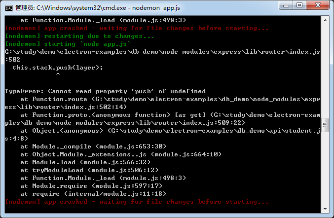
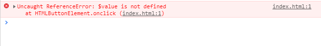
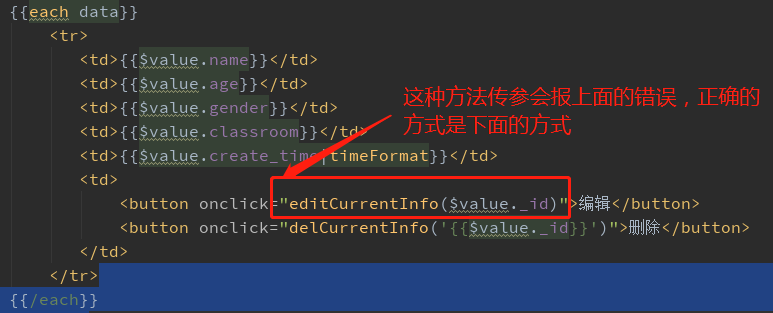
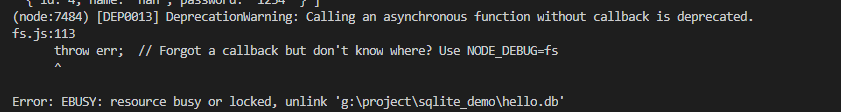
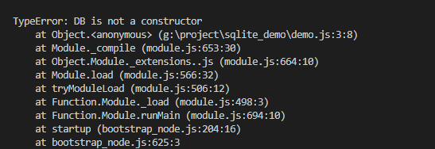

### npm

~~~css
npm root -g 查看npm 全局安装目录
设置python路径（根据自己的实际情况设置）
npm config set python .....
npm cache clean -f 删除缓存

清除所有的npm配置项
C:\Users\Administrator 找到.npmrc，打开删除文本内容
本地用户  C:\Users\Administrator 找到 .npmrc 
	添加
	registry=https://registry.npm.taobao.org/
	ELECTRON_MIRROR=http://npm.taobao.org/mirrors/electron/
系统用户 C:\Users\han\AppData\Roaming\npm\etc  下找到 .npmrc
	全局变量 npm config --global 的配置

**和npx的区别**
npm 是一个node包管理工具
npx会先检查本地有没有安装某个package，如果没有就去registry找，找到的话就直接使用，不用下载到本地node_modules包里，优化本地项目的大小避免安装package到全局

~~~

### formidable

> [参考网址][https://www.cnblogs.com/abab301/p/9489000.html]

~~~javascript
//使用方法
npm install formidable

const formidable=require('formidable')

//使用方法
let form=new formidable.IncomingForm()
//上传文件的限制和路径设置
form.uploadDir='upload' //切记切记 不能使用绝对或者相对路径，不然会报错
form.keepExtensions=true//使用上传文件的拓展名
form.maxFieldsSize=2*1024*1024 //fields最大2M
form.parse(req,(err,fields,files)=>{
    //fields为所有的表单中字段内容
    //files为上传的文件格式内容
})

特点：大而全 不需要body-parser等中间件了
~~~

### multer 文件上传的又一个插件

~~~css
只针对 type="multipart/form-data"
sigle
array
fields
var storage=multer.diskStorage({
    destination(req,file,cb){
        cb(null,'/tmp/my-uploads')
    },
    filename(req,file,cb){
        cb(null,file.fieldname+'-'+Date.now())
    }
})
const upload=multer({storage:storage})
上面的代码可以统一控制上传的文件路径和文件名

limits:{
    fileSize:'5MB' 是字符串，是上传文件大小加起来的大小进行限制
}
~~~

### express 中的路由报错

> 
>
> + 解决的方法是： 
>
>   + ~~~javascript
>    const express=require('express')
>    const router=express.Router(); //注意是Router()
>    //在中间件中使用的时候是不需要立即调用的
>    app.use('/api',userRouter)//userRouter不需要加（）立即调用
>    ~~~
>  ~~~
> 
>  ~~~
>
> ~~~
> 
> ~~~
>
> ~~~
> 
> ~~~
>
> ~~~
> 
> ~~~

### 关于axios请求报错ECONNRESET

~~~css
econnreset
axios({})在请求中加上timeout的时间限制  延长>1000（默认值）
~~~

### art-template 

> **js的模板引擎** 在模板中使用方法的传参方式
>
> + 
>
> + 解决方法
>
>   

### sqlite3 

#### 新建并打开数据库

+ new sqlite3.database(filename,[mode],[callback]) 返回一个自动打开的数据库对象

  + ~~~javascript
    filename :有效的文件名，“test.db” 如果是:":memory",表示是内存数据库，数据不会持久化保存
    mode: 数据库的模式3种， sqlite3.OPEN_READONLY, sqlite3.OPEN_READWRITE, sqlite3.OPEN_CREATE
    callback :成功或者错误时调用，第一个参数是错误，或者空对象
    ~~~

#### 关闭数据库

+ database.close([callback]) 关闭一个数据库的链接对象

  + ~~~javascript
    callback 关闭成功的回调。第一个参数是一个错误，为null表示成功关闭
    ~~~

#### 执行DDL和DML  

>  数据查询语言DQL，数据操纵语言DML，数据定义语言DDL，数据控制语言DCL。 
>
>  + DQL
>
>  ~~~css
>  select
>  from
>  where
>  ~~~
>
>  + DML
>
>  ~~~css 
>  insert
>  update
>  delete
>  ~~~
>
>  + DDL
>
>  ~~~css 
>  创建数据库中的各种对象---表.视图
>  create table/view/index/syn/cluster 
>  		表  视图 索引 同义词 簇
>  ~~~
>
>  + database.run(sql,[param,...], [callback])
>
>  ~~~javascript
>  sql:要运行的sql字符串。sql类型是 DDL和DML, DQL不能使用这个命令。执行后返回值不包含任何结果，必须通过回调函数获取执行结果
>  ~~~
>
>  param,...: 当sql语句中包含（?）时，这里可以传入对应的参数
>
>  ~~~javascript
>  // 直接通过参数传值.
>  db.run("UPDATE tbl SET name = ? WHERE id = ?", "bar", 2);
>   
>  // 将值封装为一个数组传值.
>  db.run("UPDATE tbl SET name = ? WHERE id = ?", [ "bar", 2 ]);
>  
>  // 使用一个json传值.参数的前缀可以是“:name”，“@name”和“$name”。推荐用“$name”形式
>  db.run("UPDATE tbl SET name = $name WHERE id = $id", {
>  $id: 2,
>  $name: "bar"
>  });
>  ~~~
>
>  callback: 如果执行成功，则第一个参数为null，否则就是出错。
>
>  ~~~javascript
>  callback（可选）：
>  
>  如果执行成功，上下文this包含两个属性：lastID和changes。lastID表示在执行INSERT命令语句时，最后一条数据的id；changes表示UPADTE命令和DELETE命令时候，影响的数据行数。
>  ~~~
>
>  Database
>
>  + 用法：new sqlite3.Database(filename,[mode],[callback])
>  + 功能：返回数据库对象并且自动打开和链接数据库，他没有独立打开数据库的方法
>
>  close
>
>  + 用法：close([callback])
>  + 功能：关闭和释放数据库对象
>
>  run 
>
>  + 用法：run(sql,[param,...],[callback])
>  + 功能：运行指定的sql语句，完成之后调用回调函数
>
>  get
>
>  + 用法：get(sql,[param,...],[callback])
>  + 功能：运行指定的sql语句，完成后调用回调函数，回调函数有两个参数，执行成功第一个为null,第二个参数为执行的结果
>
>  all 
>
>  + 用法： all(sql,[param,...],[callback])
>  + 功能：运行指定sql语句，完成后调用回调函数。成功第一个参数为null，第二个参数为查询的结果集
>
>  prepare
>
>  + 用法：prepare(sql,[param,...],[callback])

### sqlite3.close() 

+  警告:不回调而调用异步函数是不赞成的 

### module.exports 

+ 导出class DB{} 类/构造函数时出错 **是自己将导入的文件名写错了**

+ 

### nodejs支持的字符编码

+ 'ascii' - 仅支持 7 位 ASCII 数据。

  'utf8' - 多字节编码的 Unicode 字符。

  'utf16le' - 2 或 4 个字节，小端序编码的 Unicode 字符。支持代理对（U+10000 至 U+10FFFF）。

  'ucs2' - 'utf16le' 的别名。

  'base64' - Base64 编码。

  'latin1' - 将 Buffer 编码成单字节编码的字符串。

  'binary' - 'latin1' 的别名。

  'hex' - 将每个字节编码成两个十六进制字符。

### 代码块的注释方法 （vscode和webstorm编辑器）快捷方法

~~~javascript
//vscode "/**"+'enter'
//webstorm "/**"+enter
~~~

### bodyParser.urlencoded({extended:false/true})

~~~css
extended:false/true的区别
bodyParser.urlencoded 用来解析 request 中 body的 urlencoded字符， 只支持utf-8的编码的字符,也支持自动的解析gzip和 zlib
返回的对象是一个键值对，当extended为false的时候，键值对中的值就为'String'或'Array'形式，为true的时候，则可为任何数据类型。
extended: false：表示使用系统模块querystring来处理，也是官方推荐的 默认的值为false
extended: true：表示使用第三方模块qs来处理

~~~

### 用axios调用后台接口时,baseurl自己变成了localhost,怎么改呢

~~~css
不在后端设置完整的路径
在前端调用时 baseURL+文件名称 可以解决baseURL变成localhost
~~~

### express中 重新定义html静态文件的文件夹名称

~~~css
app.set('views',path.join(__dirname,'src'))//views 是默认值 后面是修改值
~~~

### 数据库

#### mysql

##### 创建数据库的操作

~~~css
1.create database python3(这是数据库创建的名称，自己定义) charset=utf8;
2.show databases;列出所有的database
3.select database(); 当前的数据库名
4.use python3(数据库名)； 切换数据库
5.drop python3; 删除数据库
~~~

##### 数据库中表的操作

~~~css
1.create table students(
	id int not null auto_increment primary key,
	name varchar(18) not null,
	gender bit default 0
);
2.alter table students add|drop|change （字段的类型和约束）；
	alter table students add isDel bit default 0;
3.drop table students(表名);删除表名
4.desc students; 查看表结构
5.rename table xxx(旧表名) to xxx(新表名)
~~~

##### 数据库中表的数据操作

~~~css
1.select * from xxx（表名）;
~~~

~~~css
2.insert into xxx values();
全列插入：insert into 表名 values(...)
缺省插入：insert into 表名(列1,...) values(值1,...)
同时插入多条数据：insert into 表名 values(...),(...)...;
或insert into 表名(列1,...) values(值1,...),(值1,...)...;
~~~

~~~css
3.update
update xxx(表名) set 列1=值1,... where 条件
~~~

~~~css
4.delete
delete from 表名 where 条件 //物理删除
update xxx set isDel=1 where...;
~~~

##### mysql中的子查询

~~~css
**子查询中，程序先运行嵌套在最内层的语句，再运行外层的语句**

子查询一共有三种方法
1.where 中的子查询
	select goods_id,goods_name,goods_price from goods where goods_id=(select max(goods_id) from goods)
where 列=（内层sql）则内存sql返回的必须是单行单列 单个值
where 列 in (内层sql) 则内层sql返回的必须是单列，但是可以是多行

2.from 型子查询
***查询结果在结构上可以当成表看，即可以再次查询
~~~

##### mysql中的sql防止注入

~~~css
针对前端传输过来的数据 提取是使用 mysql.escape(username) mysql.escape(password)
~~~

### 原生模块

~~~css
cookie的注意事项：
	1.httpOnly 定义在cookie中时 是在浏览器端脚本代码无法修改cookie值			（document.cookie='...'），但是在Application 存储的cookie值还是可以手动修改的
	2.在解析cookie值的时候是没有获取到 path 和 expires 的值的，只是获取到了k=v 类型的值	
~~~

~~~css
session值的注意事项

~~~

### Express 

#### https和http协议的使用

~~~css
express=require('express')
app=express()
http=require('http').createServer(app)
//https需要openssl生成ssl证书
fs=require('fs')
let credential={}
credential.key=fs.readFileSync('private.pem')
credential.cert=fs.readFileSync('file.crt')
https=require('https').createServer(credential,app)
~~~

+ openssl证书的生成的方法

  ~~~css
  //生成私钥key文件
  1.openssl genrsa 1024 private.pem
  //通过私钥生成CSR证书签名
  2.openssl req -new -key private.pem -out csr.pem
  //通过私钥文件和csr证书签名生成证书文件
  3.openssl x509 -req -days 365 -in csr.pem -signkey private.pem -out file.crt
  
  private.pem 私钥
  csr.pem		证书签名
  file.crt	证书文件
  ~~~

#### express 设置返回的状态值的方法

~~~css
res.status(204)
~~~

#### express中动态路由的设置方法

~~~css
1.app.get('/user/:aid',(req,res)=>{}) 获取动态路由的参数方法为 req.params 返回的结果为：{aid:'你在路由user/后面中输入的字符串'}
2.app.get('/user/*.png',(req,res)=>{}) 这也是一种动态的路由方式 获取它的参数的方法为 req.params 
返回的结果为 {'0':'你在/user/后面输入的所有字符'} 如{'0':'1234'} {'0','324asdfa'} 都行
req.params[0] 即可获取到值
~~~

#### cookie 的过期时间是世界时间

~~~css 
expires=date.toUTCString()

在原生模块中设置 cookie的方式 为
res.setHeader('Set-Cookie','key=value; key=value; path=/; expires=')
注意的是：path expires 有默认值

~~~

#### csrf

~~~css
使用的库: csurf({cookie:false/true})
cookie
确定用户的令牌秘密是否存在cookie或 req.session 中.
cookie默认值为false
当cookie设置成 true , 然后模块会改变行为并不在使用 req.session。意味着不需要使用session中间件。相反，在此组件之前，只需使用 cookie-parser 中间件
{cookie:{key:'_csrf',path:'/'}}
key - 用于存储令牌的cookie名称（默认：_csrf）

path - cookie的路径（默认：/）

其他选项参考 res.cookie
在路由或控制器中获取token的方法为：req.crsfToken()

不需要验证csrf的路由放在 app.use(csrf({cookie:true}))之前

如果csurf()为空的时候，就需要express-session的中间件配合了
获取token的方法为 req.session.csrfSecret属性

crsf的错误捕获 err.code==='EBADCSRFTOKEN'
~~~

#### 短信验证码

~~~css
leanCloud 
npm install -S leanClound-storage 
let sms=requrie('leanClound-storage');
sms.init({
    appId:'',
    appKey:'',
    serverURL:''
})
//向第三方请求验证码
sms.Cloud.requestSmsCode({
    mobilePhoneNumber: '17511694655', // 目标手机号
    name: 'test',      // 控制台预设的模板名称
    code:'验证码',                  // 控制台预设的短信签名
    ttl:1,
    op:'nothing seek,nothing find'
}).then(ret=>{
    //成功
}).catch(err=>{
    //失败
})
//向第三方发送验证验证码
sms.Cloud.verifySmsCode([前端发来的参数]).then().catch()
~~~

#### 邮箱验证码

~~~css
const nodemailer = require("nodemailer");

//发送方的邮箱host查找：node_modules=>nodemailer=>lib=>well-known=>services.json

//创建邮件的发送对象
let transporter = nodemailer.createTransport({
    host: "smtp.qq.com",//发送方的邮箱 qq等
    port: 465,
    secure: true, // true for 465, false for other ports
    auth: {
        user: '1084266319@qq.com', // 发送方的邮箱地址
        pass: '**********', // smtp的验证码 【用手机号码发送验证码后动态获取的】各人不同
    },
});

//邮件信息
let mailobj = {
    from: '"Fred Foo 👻" <1084266319@qq.com>', // sender address
    to: "1084266319@qq.com", // list of receivers
    subject: "Hello ✔", // Subject line
    text: "Hello world?", // plain text body
    html: "<b>您的验证码是1234567</b>", // html body
};

//发送邮件
transporter.sendMail(mailobj)// 异步的函数
异步的函数 会有回调函数
transporter.sendMain(mailobj,(err,data)=>{
    if(err){console.log(err);return }
    console.log('success:',data)
})

~~~

#### jsonwebtoken的验证方式

~~~css
RFC 7519开放标准
定义了一种紧凑且独立的方式，可以将各方的信息作为json对象进行安全传输
改信息可以验证和信任，因为是经过数字签名的
~~~

~~~css
const jwt=require('jsonwebtoken')

module.exports={
    encrypt(data,time){
        //data 对象 中一定要有当前用户的id字段，这个verify时 然后到数据库中查找对应的user有用
        //secret string 本次的混合加密的字符串，默认的加密算法为SHA-256 HS256
        return jwt.sign(data,secret,{expiresIn:time})
    }
    decrypt(token){
        try{
            let data=jwt.verify(token,secret)
            return {
                msg:true,
                id:data.id
            }
        }catch(err){
            return {
                msg:false,
                error:err
            }
        }
    }
}
~~~

#### postman中自动设置token的全局脚本

~~~css
选择Tests的标签页
var jsonData=pm.response.json();
pm.globals.set('token',jsonData.token)

后面就可以在 鉴权 Authorization标签页中
选择Type:Bear Token选项
Token中填入 {{token}}
~~~

#### session 和jwt的比较 ：认证和授权方式

~~~css
session相比于JWT,最大的优势在于服务器可以主动清除session
session保存在服务器端，相对安全
session结合cookie使用,较为灵活，兼容性好

劣势：
cookie+session 在跨域场景下表现不好
分布式的部署，需要做多机共享session
基于cookie的机制很容易被CSRF
查询session信息可能会有数据库的查询操作

比较：
可拓展性：jwt
安全性：都会遇到攻击
	csrf 
	xss
	中间人攻击 https预防
session 不符合 restful api的架构限制
性能：各有利弊
时效性：jwt只有在过期后自动销毁
		session 可以被删除

~~~

### cheerio 只能是对标签使用jquery的dom操作

~~~css
$=cheerio.load(url)
//出现乱码的问题
$=cheerio.load(url,{decodeEntities:false})

~~~

### nodejs 的优缺点

~~~css
优点：
1、高并发
2.异步
3.事件驱动
4.单线程
缺点：
1.大量的匿名函数，使得异常错误的解读困难
2.try/catch只能捕获同步代码的异常，nodejs对异步代码的异常捕获较为困难
~~~

### 开发server端和前端的区别

~~~css
server服务端需要考虑的有：
1.服务的稳定性
	server端可能会遭受各种恶意攻击和误操作
	单个客户端可以意外挂掉，但是服务端不能
	node中用pm2做进程守候，一旦挂掉，自己会重启
2.安全
	server端要随时准备接收各种恶意攻击，前端则少很多
	如越权操作，数据库攻击等
	nodejs会登陆验证，防止越权操作。预防xss攻击和sql注入
3.cpu和内存(优化和扩展)
	客户端独占一个浏览器，内存和cpu都不是问题
	server端要承载很多请求，cpu和内存都是稀缺资源
	node用stream写日志，使用redis存session
4.日志的管理=> 日志的写入、日志的分析、日志的管理
    前端也会参与写日志，但只是日志的发起方，不关心后续
    server端要记录日志，存储日志，分析日志，前端不关心
    nodejs会有多种日志记录方式，以及如何分析日志
5.集群和服务拆分
	产品发展速度快，流量可能会迅速增加
	如何通过扩展机器和服务拆分来承载大流量？
	nodejs是单机器开发，但是从设计上支持服务拆分
~~~

### path内置模块

~~~css 
path.join(__dirname,'') //前面的__dirname和后面的路径进行拼接  当前文件的根路径和后面的输入路径拼接
path.resolve(__dirname,'') //不管后面的路径是哪个，返回的都是 绝对路径

let ret=path.resolve(__dirname,'E:\\download\\file\\01Nodejs+MongoDb')
console.log(ret)//返回 E:\download\file\01Nodejs+MongoDb
let ret2=path.join(__dirname,'E:\\download\\file\\01Nodejs+MongoDb')
console.log(ret2)//G:\study\html5W2\d9\E:\download\file\01Nodejs+MongoDb
~~~

### 网络通信

+ 网络分层

  ~~~css
  OSI七成模型
  	(数据链路层、物理层)、网络层、传输层、（应用、会话、表示层）
  TCP/IP四层模型
  	链路层、网络层、传输层、应用层
  ~~~

+ 端口数量

  ~~~css
  linux系统中的端口数量为 2**16 =65536 0~65535
  
  知名端口：0~1023
  80给http
  21给ftp
  443给https
  
  端口的作用：就是通过IP+端口号区别不同的服务
  
  ~~~

+ IP

  ~~~css
  IP就是在网络中标记一台电脑的一串数字
  在网络中标记一台电脑的数字 在本地局域网中是唯一的
  
  子网掩码：确定IP的网络号和主机号，他不能单独存在，必须和IP地址一起使用
  
  子网掩码：也是32位
  左边网络号 ，用二级制1表示
  右边主机号：用二进制0表示
  255.255.255.0 
  255.255.255 代表的是网络号
  0		代表的是主机号 
  主机号尾端不为 0 和  1
  
  ~~~

### nginx 部署问题

~~~css
nginx的目录
/usr/local
启动 注意是以root权限操作
/usr/local/nginx/sbin   ./nginx 
停止
/usr/local/nginx/sbin   ./nginx -s stop
重启
/usr/local/nginx/sbin   ./nginx -s reload
配置 
/usr/local/nginx/conf    打开配置文件 nginx.conf 

配置方法 
1.反向代理 **反向代理时 proxy_pass 后面的路由路径需要 加上 http:协议**
	输入 www.123.com 打开百度
	a.先修改 本地 hosts 文件 添加 虚拟机IP地址（nginx所在的机器） 和www.123.com 绑定
	b.nginx中 server块中 
		｛
			listen 80;
			server_name 192.168.1.115;
            location / {
				proxy_pass http://www.baidu.com
            }
		｝
** 如果配置报了 404的错误时 是因为 路径配置有错误
 默认会将location后带的URL添加到路径的最末尾
    如：location ~ /edu/ {
        root /html/;
        index index.html;
    }
    web中真实匹配的路径为：url/html/edu/index.html
        不是我以为的 url/edu/index.html
~~~

~~~css
***相当重要的部分
location [=|~|^~|~*] uri{}
=:的意思是 uri中没有正则匹配
~：uri中有正则匹配的规则,而且区分大小写
^~:很少用暂不用理解
~*：uri中有正则匹配的规则，而且不区分大小写
~~~

#### 负载均衡

~~~css
在server块的前面（不在server{}内,在http{}内）
upstream [本次负载均衡服务的名称]{
    **使用哪种方式 实现**;
    server ip地址； 不加 http 
    server ip地址；
}
location / {
    proxy_pass http://my_servers;  *********重要的事件说三遍 加上http:// http:// http://
    index index.html;
}
1.轮询
每个请求按时间顺序逐一分配到不同的后端服务器，服务器挂掉一个，自动剔除；
2.权重
weight代表权重 默认为1；数值越大分配到的客户端越多
3.ip_hash
每个请求按访问IP的hash结果分配，这样每个访客固定访问一个服务器
4.fair
按照服务器的响应时间来分配请求，响应时间短的优先分配

~~~

####  invalid URL prefix

~~~css
这种错误多是 没有添加 http://协议
~~~

#### 动静分离

~~~css
设置两个location 
一个配置 动态文件
一个配置 静态资源文件

静态资源的location /static/ {
    root /html/;
    autoindex on;*****重要的事情说三遍 audoindex on audoindex on autoindex on autoindex autoindex autoindex autoindex autoindex autoindex autoindex autoindex on 
}
~~~

### git 

#### git config查询和用户信息设置

~~~css
git config --list 所有的配置列表
git config --global --list 用户配置信息列表
git config user.name 
git config user.email 
git config --global user.name ...
git config --global user.email ...
git config --global --unset user.name

控制面板/用户账户/管理您的凭据 凭据管理

~~~

#### 修改和提交

~~~css
丢弃工作区的修改
git checkout -- [file] 放弃工作区的修改内容，返回最近的一次commit
添加到暂存区
git add .
暂存区到本地的版本库（贮存区）
git commit -m ""
重暂存区撤销到工作区
git reset HEAD ..

~~~

#### 分支操作

~~~css
git branch  列出当前的所有分支
git checkout -b [name] 创建一个新的分支,并且切换到新分支
git checkout [name] 切换分支
git merge [from name] 将name分支和当前所在的分支合并
git branch -d [name] 删除name分支

切换分支这个动作，用switch更科学。因此，最新版本的Git提供了新的git switch命令来切换分支：
git switch -c [name] 创建新的分支
git switch [name] 切换分支
~~~

#### 本地操作

~~~css
git add [name] 文件保存到暂存区
git add . 所有文件保存到暂存区
git commit -m "" 暂存区的文件保存到版本区
git status 查看当前的状态
git log 显示的是最近n次commit记录
git reset --hard [commit_id] 版本回退、回滚

查看 工作区和暂存区的区别
git diff 
查看 当前的版本库和工作区的区别
git diff HEAD
查看 当前版本库和暂存区的区别
git diff --cached
查看 当前版本库的不同版本的区别
git diff [提交的id版本号] [提交的ID版本号2]

删除工作区和暂存区的文件
git rm [file]
git checkout [file] 撤销掉所有的工作区修改
git reset HEAD [file] 暂存区撤销掉
git reflog 记录你所有的操作

git remote 查看远程仓库

**HEAD^ 上一个版本
HEAD^^  上上个版本
HEAD~n  到上n的版本

打包 tag 一定要先将本地的代码提交到远程仓库先
Git tag 查看当前的标签号 
git tag <版本号> -m "本次tag的说明"
	git tag v1.0.0 -m "first tag"
提交打标签 到远程仓库
git push origin v1.0.0
将本地的所有tag都提交到远程仓库
git push origin --tag 

本地的标签tag删除
git tag -d <版本号>
远程仓库端删除
git push origin :refs/tags/<版本号>

退出命令行的编辑模式的方法：window环境 ZZ(大写)
~~~

#### 初始化本地已有的项目

~~~css
本地操作
1.初始化本地仓库
	git init 
2.remote 
	git remote add origin 仓库地址（需要远程仓库已经创建好的地址）
3.从远程分支拉取master分支并与本地的master分支合并
	git pull origin master:master
4.提交本地分支到远程分支
	git push -u origin master 
5.将现有项目添加并提交上传
	git add .
	git commit -m ""
	git push origin master
~~~

### child_process子进程模块

~~~css
spawn('cmd命令',[参数或者需要执行文件的路径]) 返回一个childProcess对象，所以可以获取stdin,stdout,stderr
exec('直接写cmd命令+参数或者需要执行文件的路径') 和spawn 主要区别是有大小限制
execFile('cmd命令',[参数或者需要执行文件的路径])
fork('./test.js') 参数为文件名，意味使用 fork 方法创建了一个子进程实例 ，并且指定了子进程的的运行目录为 child.js
是 spawn 方法的变形的一种形式，也是用来创建进程。二者最大的不同之处在于：fork 方法会创建一个内置的通信信道，允许消息在父进程和子进程之间来回传递

process.exit()//直接结束当前进程
结束子进程的方法为 subchild.kill(process.pid,'终止的信号') signal：具体查看 process的信号事件
process.kill(process.pid,siganl)
~~~

#### parent.js

~~~css
const {fork}=require('child_process')

let sp=fork('./test3.js')
sp.send('hello')

process.on('message',msg=>{
    console.log('接收到了子进程的结果',msg)
})

setTimeout(()=>{
    sp.send('close')
},4000)

sp.on('close',(code,signal)=>{
    console.log(code)
    console.log('singal',signal)
})

~~~

#### test3.js

~~~css
process.on('message',msg=>{
    if(msg==='close'){
        process.exit()
    }else{
        console.log('接收到的消息为:',msg)
    }
})

count=0;
setInterval(()=>{
    count+=1;
    console.log(count)
},1000)
~~~

### Koa

~~~css
cxt 上下文环境
next是异步函数 返回的是promise类型
await next() 才能执行下一步
~~~

#### koa使用到的中间件

~~~css
koa-router
koa-bodyparser
koa-json-error  处理错误中间件
error=require("koa-json-eror") //检验 404，500，412等系统错误
app.use(error({
    postFormat:(e,{stack,...rest})=>{
        process.env.NODE_ENV==='production'?rest:{stack,...rest}
    }
})) 

koa-parameter 校验参数
app.use(parameter(app))
ctx.verifyParams({//不符合会返回422错误代码
    name:{type:'string',required:true}
})

koa-jwt 
koa-body 替换 koa-bodyparser
koa-bodyparser只支持body\form不支持文件
app.use(koaBody({
    multipart:true,
        formidable:{
            uploadDir:'上传的路径',
            keepExtentsions:true,//保留拓展名.jpg,.png...
    }
}))
//获取文件
ctx.request.files.file

koa-static 生成静态服务
	//访问的路径中没有 public
	app.use(koaStatic(path.join(__dirname,'public')))
	//访问的路径中带有 public
	app.use(KoaStatic(__dirname,'public'))

path.basename('文件的绝对路径')//这就得到了
ctx.origin 得到当前的host name 

<input accept="image/png,image/jpg,image/jpeg">

    ctx.state 约定俗成的：放置一些用户信息
    ctx.state.user=user

cxt.query  =>得到{ name: 'han', password: '1234' }
cxt.querystring => 得到 name=han&password=1234
cxt.params =>动态路由
cxt.request.body=>
	application/x-www-form-urlencoded 数据格式为：{ name: 'han', password: '1234' }
	application/json   数据格式为：{ name: 'John', password: '1234' }
~~~

#### koa-onerror

~~~css
const onerror=require('koa-onerror')
onerror(app)
这里的会有详细的错误信息
~~~

### REST ful API

~~~css
http的options的方法作用：
	检测服务器所支持的请求方法
	cors中的预检请求

router.allowedMethod()的作用：
	1.在 allow 的字段中会显示 当前URI支持的请求方式 如HEAD GET POST DELETE
	2.返回405（没有实现的方法）或者501(不允许，当前框架没有或不认识这种请求方法)

不同请求方法返回的数据信息和格式  （在成功的情况下）
	GET：返回相应的请求数据信息 
	POST:返回当前提交的数据信息
	PUT/PATCH:patch是部分编辑修改 返回的数据是当前编辑和修改的数据
	DELETE:返回的是 status=204 表示本次操作成功

常见的异常状况
	运行时错误（500服务器本身）
	逻辑错，找不到(404) 先决条件失败（412）
~~~

#### 软件架构的风格

~~~css
representational state 			transfer
表述/表达			当前状态或数据   数据传输

~~~

#### 六个限制

##### 1.cs架构

~~~css
关注点分离
服务端：专注数据存储
客户端：用户界面、可移植性
~~~

##### 2.无状态

~~~css
所有用户会话信息都保存在客户端
每次请求必须包含所有信息，不能依赖上下文信息
服务端不用保存会话信息，提升了简单性、可靠性、可见性
~~~

##### 3.缓存cache:减少前后端交互提高交互性能

~~~css
所有服务端响应都要被标为可缓存或不可缓存
减少前后端交互，提升性能
~~~

##### 4.统一接口==>最重要的限制

~~~css
接口设计尽可能统一通用，提升简单性、可靠性、可见性
接口实现解耦，使前后端可以独立开发迭代

a.资源标识：
	可以命名的事物叫资源
	每个资源可以通过URI被唯一标识
b.通过表述来操作资源
c.自描述信息
	请求和响应必须提供足够的信息让接受者理解
	媒体类型（application/json|application/xml）
	HTTP方法（get/post/patch/put/delete）
	是否缓存 cache-control
d.超媒体作为应用状态引擎
	超媒体：带文字的连接
	应用状态：一个网页
	引擎：驱动、跳转
	加起来的理解为：点击连接跳转到另一个页面
~~~

##### 5.分层系统

~~~css
每层只知道相邻的一层，后面影藏的就不知道了
客户端不知道是和代理还是真实服务器通信
其他分层：安全层、负载均衡、缓存层
~~~

##### 6.按需代码

~~~css
客户端可以下载运行服务端传来的代码
通过减少一些功能，简化客户端
~~~

#### 请求的设计规范

~~~css
尽量使用名词
使用嵌套表示关联关系 如：/users/:id/repos  用户为ID下的仓库
使用正确的http方法
不符合CRUD的情况 使用post/action[动词]/子资源
~~~

#### 安全

~~~css
https
鉴权
限流 
	在请求头中加入 X-RateLimit-limit:60		每小时允许的最大请求数
				X-RateLimit-remaining:56	当前速率限制窗口中剩余的请求数
				X-RateLimit-Reset:			当前速率限制窗口重置时间，以UTC秒为单位
~~~

### OAuth 2.0是目前最流行的授权机制，用来授权第三方应用，获取用户数据

~~~css
数据的所有者告诉系统，同意授权第三方应用进入系统，获取这些数据。系统从而产生一个短期的进入令牌，用来替代密码，供第三方应用使用

1.令牌是短期的，到期后自动失效，用户自己无法修改
2.令牌可以被数据所有者撤销，会立即失效
3.令牌有权限范围

令牌的发布方式：四种，适用不同的互联网场景

~~~

#### 四种授权方式

~~~css
01授权码
最流行，安全性最高的，适用于有后端的web应用
第一步：A 请求B
https://b.com/oauth/authorize?response_type=code&client_id=CLIENT_ID&redirect_uri=CALLBACK_URL&scope=read

response_type 返回授权码code 
client_id 让B网站知道是谁在请求
redirect_uri B网站接受或拒绝后跳转的网址
socpe表示要求的授权范围

第二步
https://a.com/callback?code=AUTHORIZATION_CODE
	返回的就是code授权码
第三步
A网站拿到授权码后，向B网站请求 令牌
https://b.com/oauth/token?client_id=CLIENT_ID&client_secret=CLIENT_SECRET&grant_type=authorization_code&code=AUTHORIZATION_CODE&redirect_uri=CALLBACK_URL
第四步
B网站收到请求后，就会颁发令牌，向redirect_uri指定的网址，发送一段json数据
{
    "access_token":"ACCSSS_TOKEN",
    "token_type":"bearer",
    "expires_in":2592000,
    "refresh_token":"REFRESH_TOKEN",//refresh_token,
    "socpe":"read",
    "uid":10001,
    "info":{
        ....
    }
}

02隐藏式
纯前端的应用，没有后端。这就需要隐藏式， 直接向前端发令牌。没有授权的中间步骤

1第一步
A提供链接到B网站，B网站授权用户数据给A网站使用
https://b.com/oauth/authorize?response_type=token&client_id=CLIENT_ID&redirect_uri=CALLBACK_URL&scope=read

response_type要求直接返回toke令牌

2.第二步
用户跳转到B网站，登录后同意给予A网站授权
http://a.com/callback#token=ACCESS_TOKEN

03密码式
高度信任某个应用，直接把B网站的密码和用户名在A网站输入,A网站拿到密码和用户名直接请求B网站的令牌
1.第一步：
https://oauth.b.com/token?grant_type=password&username=USERNAME&password=PASSWORD&client_id=CLIENT_ID
2.第二步
A网站拿到JSON数据

04客户端凭证
第一步
https://oauth.b.com/token?
  grant_type=client_credentials&
  client_id=CLIENT_ID&
  client_secret=CLIENT_SECRET

上面 URL 中，grant_type参数等于client_credentials表示采用凭证式，client_id和client_secret用来让 B 确认 A 的身份。

第二步，B 网站验证通过以后，直接返回令牌。

这种方式给出的令牌，是针对第三方应用的，而不是针对用户的，即有可能多个用户共享同一个令牌。
**不管哪种授权方式，第三方应用申请令牌前，都必须到系统进行备案，说明自己的身份,然后拿到 两个识别码 (客户端ID [client ID]) 客户端秘钥(client secret)** 防止令牌被滥用，没有备案过的第三方应用，是不会拿到令牌的的
~~~

