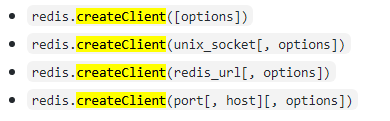
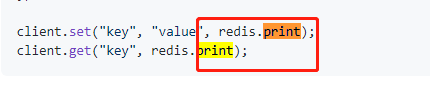

### 针对key的操作

~~~css
1.查看所有的keys
keys *
2.判断key是否存在 1存在 0不存在
exists [keyname]
3.查看
get [key]
4.删除
del [key]
5.查看键对应的value的类型
type [key]
6.设置key的有效期限
expire [key] seconds
~~~

### 插件 redis的应用注意点

#### redis.createClient()当中的传值方式有：

~~~css
const redis=require('redis')
const client=redis.createConnect()//https://github.com/noderedis/node-redis/ 详细配置

事件
on('error',callback)
on('connect',callback)
on('end',callback)
on('warning',callback)
方法
client.quit() 这会将quit命令发送到redis服务器，并在正确处理了所有正在运行的命令后立即干净结束
client.end(true) 强制关闭与Redis服务器的连接
client.get('',callback)
client.set('',callback)
client.print()
~~~

#### 注意redis无法连接上的原因

~~~css
最重要的一条修改 redis.conf的配置文件
将bind 127.0.0.1 改为 bind 0.0.0.0 即所有地址均可连接，然后./redis-server ../redis.conf指定配置文件启动测试，仍然无法连接，继续排查，有网友说可能是服务器防火墙的问题，咱关了防火墙试下
firewall-cmd --add-port=6379/tcp --parmanent
firewall-cmd --reload

~~~

#### 使用client.set(key,val,redis.print) 报错

~~~css
**MISCONF Redis is configured to save RDB snapshots, **

127.0.0.1:6379> config set stop-writes-on-bgsave-error no
~~~

