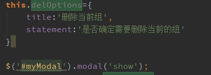
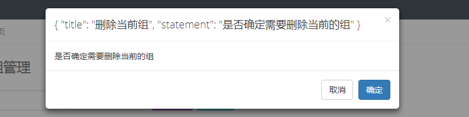
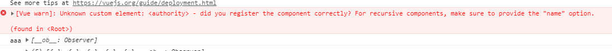

### Vue-component

> ~~~javascript
> <item-li :options="optionObj"></item-li>
> 
> props:{
> 	options:Object;
> }
> /*
> 在使用props传递参数值时，在父组件中的属性命名方法为optionObj{title:'aaa',statement:'bbbb'},
> 不能使用optionObj.title='aaaa',optionObj.statement="bbbb"的方法
> 因为不能获取到任何数据
> */
> ~~~
>
> 
>
> 

#### [Vue warn]: Unknown custom element

> 

### filters 

#### Error in render: "TypeError: Cannot read property

+ 过滤器中的this不是指向的vm实例对象的，所以会在页面中报告如下的错误
  + 
  + 解决的方法是将this.属性名定义为全局的变量, 在filters中不用使用this关键字

### keep-alive

> **主要用于组件状态保存或者避免重复渲染**
>
> > exclude 不缓存 || include 缓存项
>
> ~~~html
> /*exclude是指不需要缓存的组件名*/ a和b是在每个组件中的命名名称 ：如图
> <keep-alive :exclude="['a','b']"></keep-alive> 数组中的为字符串形式
> <keep-alive :exclude="/a|b/"></keep-alive> 配合正则
> <keep-alive exclude="a,b"></keep-alive> 不是用属性绑定的形式 注意直接写组件名
> ~~~
>
> 

