### eslintrc.js的配置

~~~css
主要作用就是检测代码的合法性、代码格式化
代码合法性范围（JavaScript、JSX、ES6、Html、JSDoc、posts、vue、React、AngularJS、React Native、mocha）
eslint配置详细介绍：https://blog.csdn.net/q3254421/article/details/86477502
~~~

### Vue-component

#### Component template should contain exactly one root element.

~~~css
解决的方式是 template中使用一个大标签,包裹住所有的子标签
~~~

#### Avoid mutating a prop directly since the value will be overwritten whenever the parent component re-renders

~~~css
大概的意思是：通过props传递给子组件的 属性值，不能在子组件内部修改props中的 属性值。
需要通过 this.$emit的方式 事件触发机制，让父组件自己改变 属性值

子组件模板上 this.$emit('事件名-自定义的','需要的发送到父组件中改变的值')
在父组件中的 插入的子组件名标签
<sub-component :props对应的名="传递的属性名" @事件名-自定义的="对应父组件中的事件方法"></sub-component>
~~~

### filters 

#### Error in render: "TypeError: Cannot read property

+ 过滤器中的this不是指向的vm实例对象的，所以会在页面中报告如下的错误
  + 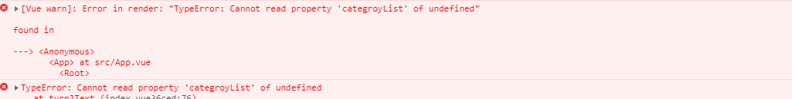
  + 解决的方法是将this.属性名定义为全局的变量, 在filters中不用使用this关键字

### keep-alive

> **主要用于组件状态保存或者避免重复渲染**
>
> > exclude 不缓存 || include 缓存项
>
> ~~~html
> /*exclude是指不需要缓存的组件名*/ a和b是在每个组件中的命名名称 ：如图
> <keep-alive :exclude="['a','b']"></keep-alive> 数组中的为字符串形式
> <keep-alive :exclude="/a|b/"></keep-alive> 配合正则
> <keep-alive exclude="a,b"></keep-alive> 不是用属性绑定的形式 注意直接写组件名
> ~~~
>
> 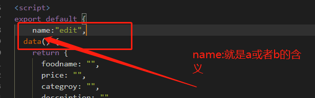

### vue-router 中不能多次点击同一个router-link 的问题

+  点击同一个路由，页面报错 

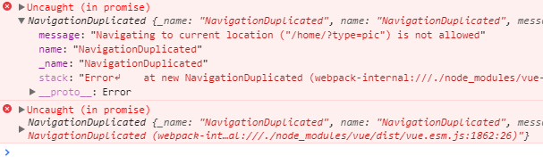

+ 解决的方法 在后面加上catch(err=>{err})

  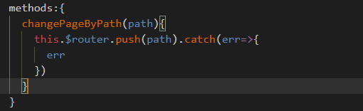

+ 嵌套路由的默认页面设置

  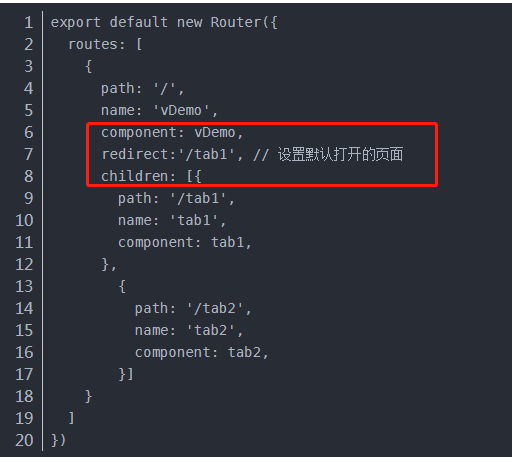

### 导入图片路径时出现错误：静态资源找不到

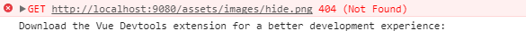

+ 解决方法为：使用import defaultImagePath from '...../.../' (相对或者绝对路径)

### Unexpected token u in JSON at position 0

+  其实很简单，这个错误是**由于JSON.parse解析了undefined**。 

### Failed to resolve directive: mode

+  未能解析指令：mode   => 有未识别的v-model  即有可能是将model单词平措了

### filter 过滤器中转换html标签

~~~javascript	
<td v-html="$options.filters.turn2CurrentWord(item.isCurrent)"></td>
Vue.filter('turn2CurrentWord',(val)=>{
    return 'ddd'
})
~~~

###  Prop "allprogram" is passed to component  

+ 错误原因是 prop传值时的命名方法错误，如果传入的是allProgram="allProgram"就会报错，使用下面的方法就不会报错
+ 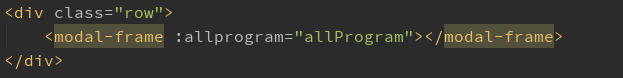

### 单击和双击的时间间隔设定为200ms

~~~css
解决方法为：将单击是的时间延长
~~~

### Duplicate keys detected: '0'.

> 错误原因是在使用v-for的时候，都要加上一个唯一的key值，但是在这里写了两个for循环，尽管都加上了key值，但是又将key值写成一样的了，所以就会导致报错
>
> 解决方法
>
> + 修改其中的绑定的key值
>
>   ~~~html
>   

>   

>   ~~~
>
>   
>
>   

###  在radio输入框中操作v-model的注意事项

~~~css
1.相同name类型的input type=radio中 v-model绑定的数据属性名称 相同
2.注意 绑定的数据值是 字符串类型的 ，在遇到true 和false时是需要注意 值的类型转换，不然的话 在使用 v-if 对绑定的数据属性名称 进行判断时 是不会有 交互效果的
~~~

### vue-cli 

#### public和assets的区别

~~~css
public中的文件是不会经过webpack的打包处理的
assets 文件夹中的文件会经过webpack的打包处理

public中的资源在引用是 **一定要使用绝对路径**,不然会找不到，报错
使用方式为：img/filename.jpg      不需要加上public /public/img/filename.jpg 这是不对的
~~~

#### nextTick

~~~css
nextTick的回调函数，在下一次DOM更新后立即执行
即在数据初次发生变化后，在使用js的方法调用DOM中的值，得到的结果还是原来的初始值，不是更新后的值，需要二次点击才可以获取到变化的值，
因此 调用$nextTick() 函数 可以得到在 需要在下一次DOM更新后的新值
~~~

### Vue.js知识点

~~~css
new Vue({
    选择对象：data\props\propsData\computed\watch\methods
})
注意点：只有在实例对象创建时已经在data对象中的属性才是 响应式的 响应式 响应式

计算属性：是基于它们的响应式依赖进行缓存的 就是说data中的属性值变成才能引起计算属性的变化

class 和style 绑定
方式除了 有字符串外 还有 对象绑定 数组绑定的方式 
:class="{active:isActive,color-style:isGray}" 常用来启用动态的样式切换
对象中可以是多键值对的形式
动态的绑定的class 不仅仅是可以存放在内联样式内，还可以放在 data的对象中
:class="classObject"
data(){
    return {
        classObject:{
            active:true,
            'color-style':false
        }
    }
}

class 放在数组中的方式 [active,error]这需要 data对象的关联

:style样式绑定 
1.内联的对象方式绑定 :style="{color:data对象中的属性名}"
2.在data对象中直接使用 属性对象绑定 styleobject:{color:'',fontSize:'23px'}注意一定要使用 驼峰的命名方式
3.数组的绑定方式

~~~

#### 条件渲染

~~~css
使用template 元素当做一个不可见的包裹元素 v-if 条件渲染后浏览器不会显示template
注意点 v-if="loginType==='username'"
	  v-else
	这里的loginType 将不会清除 用户已经输入的内容，如果应为两个模板使用了相同的元素input 那么input 不会被替换掉，只是替换了placeholder的提示信息 用户的输入内容是一应的 如下图所示

解决方式： 这两个元素完全独立，不要复用它们
	在条件编译v-if的容器中在相同的元素标签中 加上 key属性 
	如：<input placeholder="your name please" key="username">
	   <input placeholder="your email" key="email">

~~~

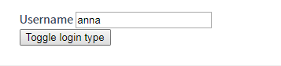

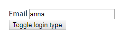

~~~css
v-if 和v-show的区别是：
v-show是始终都会存在DOM的结构树中的，只是简单切换元素的display
~~~

#### 遍历渲染

~~~css
可以使用of 替代in
v-for="(item,index) in list"
v-for="(item,index) of list"

v-for 遍历对象 object:{name:'jane',title:'nothing seek,nothing find'}
v-for="(v,k) in object" :key=k

~~~

#### vue不能检测数组和对象的变化,回避方式有如下：

~~~css
对象：vue无法检测property 的添加或者移除
var vm=new Vue({
    data(){
        //data中没有someobject 属性 
    }
});

Vue.set(vm.someobject,'b',2) 就会有响应式的根级别的属性someobject 
或者
this.$set(this.someobject,'b',2)

对于已经存在的对象 添加新的属性时，使用Object.assign()方式
this.someObject=Object.assign({},this.someobject,{a:1,b:2})

数组不响应的地方有
	利用数组索引直接改变一个数组项 不响应
	修改数组的长度时 不响应 
对于第一个问题的解决方案 是使用 this.$set(items,'索引值',newVaule)
对于第二个问题的解决方案 是使用 this.items.splice(index,1)
~~~

#### 事件处理

~~~css
事件修饰符：
stop\prevent\once\capture\self\passive

<form :submit.prevent="onSubmit"></form>
once事件只会触发一次
capture:使用事件捕获模式，即内部触发的事件现在此处理，然后才交给内部元素处理
self:只有当event.target时当前的元素自身时才会触发处理函数，即内部元素不会触发

按键修饰符
enter\tab\delete\esc\space\up\down\left\right

系统修饰符
ctrl\alt\shift\meta

.exact 精确的系统修饰符
:click.exact="onClick" 没有其他的修饰符下，按下才能触发
:click.ctrl.exact="onCtrlClick"

鼠标修饰符
right
left
middle
~~~

#### 表单输入绑定

~~~css
使用v-model指令 创建双向数据绑定 语法糖
有效的标签元素 select input textarea

**v-model 会忽略 表单元素的的value checked selected 的初始值， 而是将vue实例中的根数据当做数据来源

text/textarea使用 value 绑定 触发 input事件
checkbox radio 使用checked 绑定 触发change事件
select 使用value绑定 触发change事件

** <textarea>{{text}}</textarea> 这是错误的解析模式
应该使用 v-model

v-model的修饰符
	v-model.lazy 数据不会立即双向改变，需要通过事件change事件之后触发

	v-model.number 数据转成number类型的
	v-model.trim 过滤掉收尾的空白字符

~~~

#### 注册组件

~~~css
组件名的命名规范：字母全小写且必须包含一个连字符
***重要的事情说三遍 组件名：字母全部小写，必须包含连字符

动态组件
使用 keeep-alive将动态组件包裹起来，会将失活的组件状态缓存起来
<keep-alive>
	动态组件标签  <component :is="自定义的组件名"></component>
</keep-alive>

异步的组件加载
局部
componets:{
    '组件名'：()=>{
        return import('./ComponentA.js')
    }
}
全局
Vue.component('组件名',()=>{
    return import('./componentA.js')
})

Props
出字符串外
Boolean,Array,Number,Object
即使是静态的属性，我们也要用v-bind告诉Vue

所有的prop使得父子之间形成了一个单向下行绑定
父级prop的更新会向下更新子组件的数据，但是反过来不行
这意味着你不应该在一个子组件内部改变 prop。如果你这样做了，Vue 会在浏览器的控制台中发出警告。

有两种情况是例外的
props:['initialCounter'],
data(){
    return {
        count:this.initialCounter//prop 用来传递一个初始值；这个子组件接下来希望将其作为一个本地的 prop 数据来使用
    }
}

2.
props:['size'],
computed:{
    normalizedSize(){
        return this.size.trim().toLowerCase()// prop 以一种原始的值传入且需要进行转换
    }
}
Html中的attribute名是大小写不敏感的，所以浏览器会将所有的大写字符解释为小写字符。这意味着当你使用DOM中的模板时，camelCase(驼峰命名法)的prop名称需要使用等价的kebab-case（短横线分隔命名）

~~~

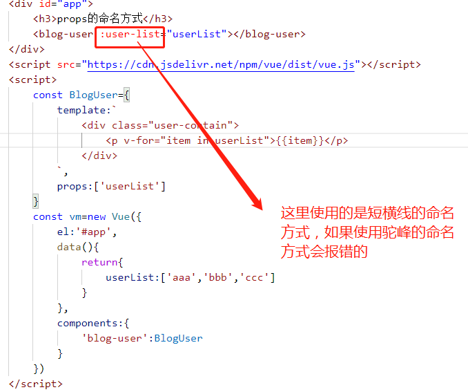

#### 组件上使用v-model

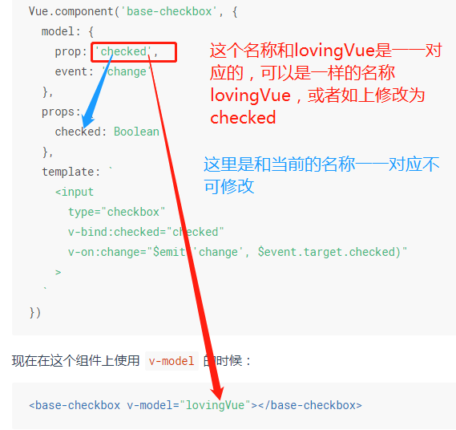

#### 访问根实例中的属性和方法

~~~css
在每个new Vue()实例的子组件中，可以通过this.$root.[new Vue()实例中的属性名或方法]进行访问。
~~~

#### 组件中的render方法

~~~css
render:function(createElement){
    return createElement(a,b)
    
}
createElement的参数和配置
createElement(
  // {String | Object | Function}
  // 一个 HTML 标签名、组件选项对象，或者
  // resolve 了上述任何一种的一个 async 函数。必填项。
  'div',

  // {Object}
  // 一个与模板中 attribute 对应的数据对象。可选。
  {
    // (详情见下一节)
  },

  // {String | Array}
  // 子级虚拟节点 (VNodes)，由 `createElement()` 构建而成，
  // 也可以使用字符串来生成“文本虚拟节点”。可选。
  [
    '先写一些文字',
    createElement('h1', '一则头条'),
    createElement(MyComponent, {
      props: {
        someProp: 'foobar'
      }
    })
  ]
)
~~~

#### this.$emit('自定义的事件名')

~~~css
自定义的事件名一定是 'my-event'的短横线的形式，或者 myevent的形式，不可使用 驼峰的命名方式
如果是 this.$emit('myEvent')的方式
<my-component @myEvent="doSomething"></my-component> 这种方式的监听是不会触发doSomething的函数方法 就算是改成 @myevent时，也不行，所以得是将 this.$emit('my-event') @my-event 这样子才行
~~~

#### slot插槽

~~~css
<slot name="..."></slot> 定义在自定义的组件中
在需要插入自定义组件的模块中 使用
<template v-slot:[name]>
	【这里的所有东西都会被放入slot的内容中】
</template>

**v-slot 只能添加在 <template>**

插槽属性prop的传值
在父组件中
<parent-layout>
	<template v-slot:default="父组件中data中的属性名">
		{{父组件中data中的属性名}}
	</template>
</parent-layout>
在parent-layout的模板中

	<slot></slot>

v-slot:[slot的名称]的缩写 #[slot的名称]

插槽作用域的理解：就是在子组件中的跟属性 值的修改可以在 父组件中修改，父组件中修改的值还是子组件提供的
~~~

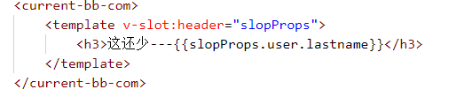

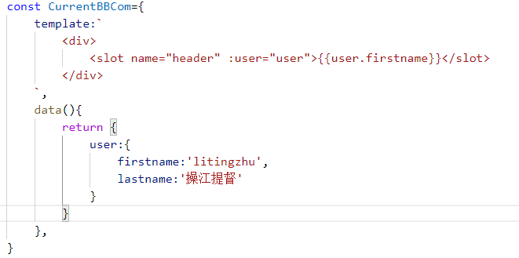

#### 全局配置

~~~css
在入口文件main.js中配置
Vue.config.silent=true	取消vue所有的日志和警告
Vue.config.devtools=true/false 	是否允许vue-devtools检查代码 开发dev true, 生产pro为false

Vue.config.keyCodes={
    v:86,
    f1:112,
    "media-play-pause":179,不能使用驼峰命名的方式
    up:[38,87]
    
}
给v-on 自定义键位别名
<input @keyup.media-play-pause="method的方法名">
    
Vue.config.productionTip=true/false    false时阻止vue在启动时生产生产提示
~~~

#### 全局api

~~~css
Vue.extend() 创建一个子类

const Container=Vue.extend({
    template:``,
    data(){
        return{
            
        }   
    }
})
new Container().$mount('#box')

Vue.nextTick()
Vue.set(target,propName,value)
Vue.delete(target,propName)
Vue.use(插件) 安装插件
Vue.version 这是属性 console.log(Vue.version)
~~~

#### 选项/数据

~~~css
props:{
    username:{
        type:String,
        default:'',默认值
        required:true/false 
        validator:function(val){
           //验证函数
            return val>0
        }
        
    }
}
~~~

### vue-cli

#### 缓存和并行处理

~~~css
cache-loader 会默认为Vue编译开启，文件缓存在node_modules/.cache中，如果遇到了编译的问题，记得先删除掉缓存目录之后再试试看

~~~

#### 相对路径导入

~~~css
js,css或.vue文件中使用相对路径(必须以.开头)引用一个静态资源，该资源会被webpack加入依赖包
~~~

#### vue.config.js

~~~css
devServer:{
    proxy:{
        '/api':{
           	target:url,
            ws:true/false,// 代理websocket
            changeOrigin:true/false  //请求头中host仍然是浏览器发送过来的host
            pathRewrite:{
            	'要修改的地方':'修改后的'        
            }
        },
        '/blog':{
            target:url
        }
    }
}
~~~

##### 查看打包后的文件大小分析

~~~js
chainWebpack: (config) => {
    if (process.env.NODE_ENV==='production') {
        config
            .plugin('webpack-bundle-analyzer')
            .use(require('webpack-bundle-analyzer').BundleAnalyzerPlugin)
    }
},
    
    
   package.json =>加入 --report
~~~

#### 自定义的组件中template的模板可以分开写

~~~css
方法1
const MyComponent={
    template:``,
        data(){
            return {}
    }
}
方法2
在html结构中
<body>
	如下插入script
	
</body>
注意：script需要放在vue.min.js之下
const MyComponent={
    template:'#[模板的id标识符]',//注意#不能漏掉
        data(){
            return {}
    }
}

~~~

